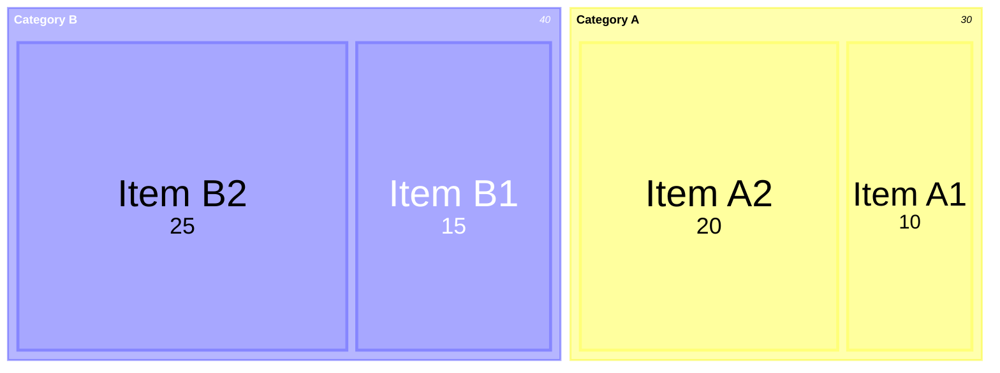
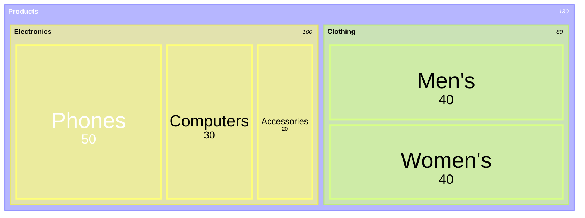
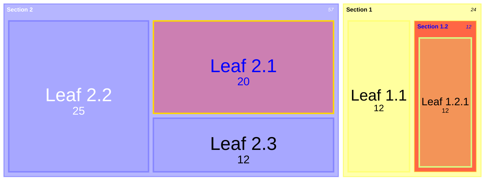
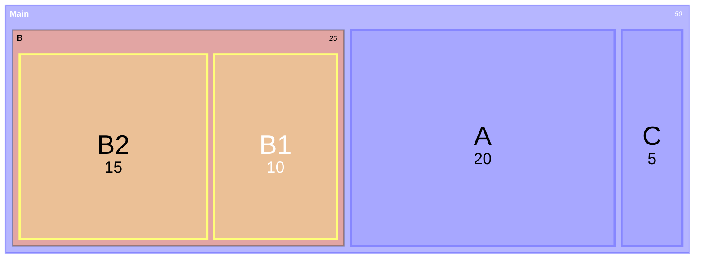
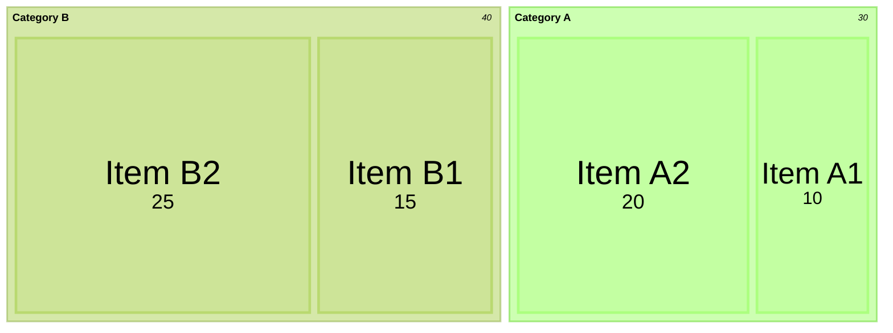
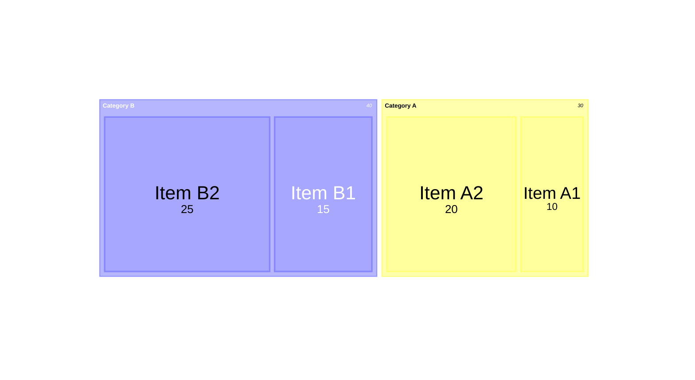
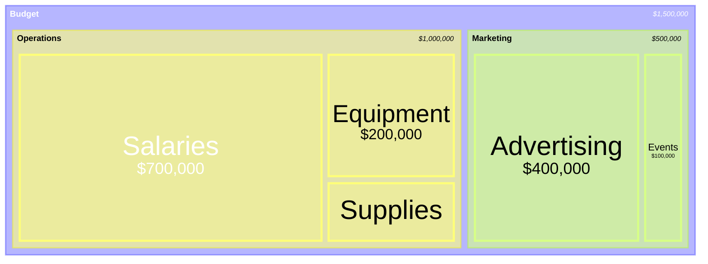
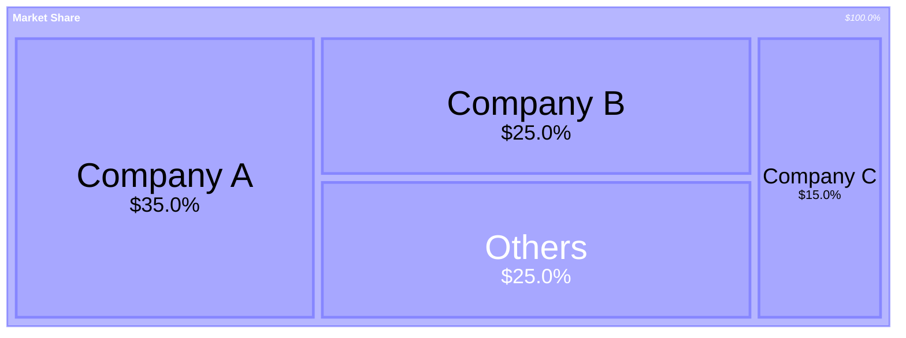

## Instructions

Treemap diagrams display hierarchical data as a set of nested rectangles. Each branch of the tree is represented by a rectangle, which is then tiled with smaller rectangles representing sub-branches. The size of each rectangle is proportional to the value it represents, making it easy to compare different parts of a hierarchy.

**Note**: This is a new diagram type in Mermaid. Its syntax may evolve in future versions.

### Syntax

- Use `treemap-beta` keyword (requires Mermaid v11.0.0+, experimental feature 🔥)
- Section/Parent nodes: `"Section Name"` (quoted text)
- Leaf nodes with values: `"Leaf Name": value` (quoted text followed by colon and value)
- Hierarchy: Created using indentation (spaces or tabs)
- Styling: Nodes can be styled using `:::class` syntax
- Root node: The first node is the root of the tree
- Configuration: `useMaxWidth`, `padding`, `diagramPadding`, `showValues`, `nodeWidth`, `nodeHeight`, `borderWidth`, `valueFontSize`, `labelFontSize`, `valueFormat`

Reference: [Mermaid Treemap Diagram Documentation](https://mermaid.js.org/syntax/treemap.html)

### Example (Basic Treemap)

A simple treemap with categories and items:

### Example (Hierarchical Treemap)

A treemap with multiple levels of hierarchy:

### Example (With Styling)

Style nodes using classDef:

### Example (Using classDef for Styling)

Another example of styling with classDef:

### Example (With Theme Configuration)

Configure treemap theme:

### Example (With Diagram Padding)

Adjust padding around the treemap:

### Example (With Currency Formatting)

Format values as currency:

### Example (With Percentage Formatting)

Format values as percentages:

### Alternative (Flowchart - compatible with all Mermaid versions)

If treemap diagrams are not supported, use this flowchart alternative:

