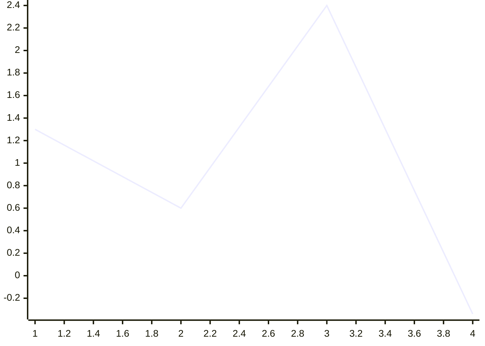
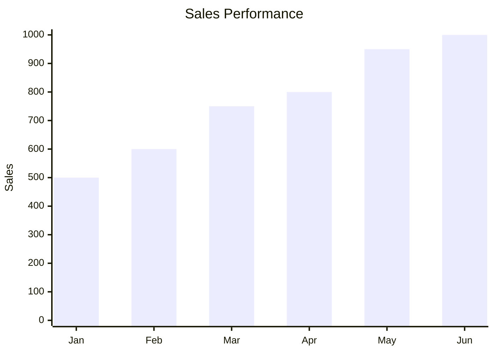
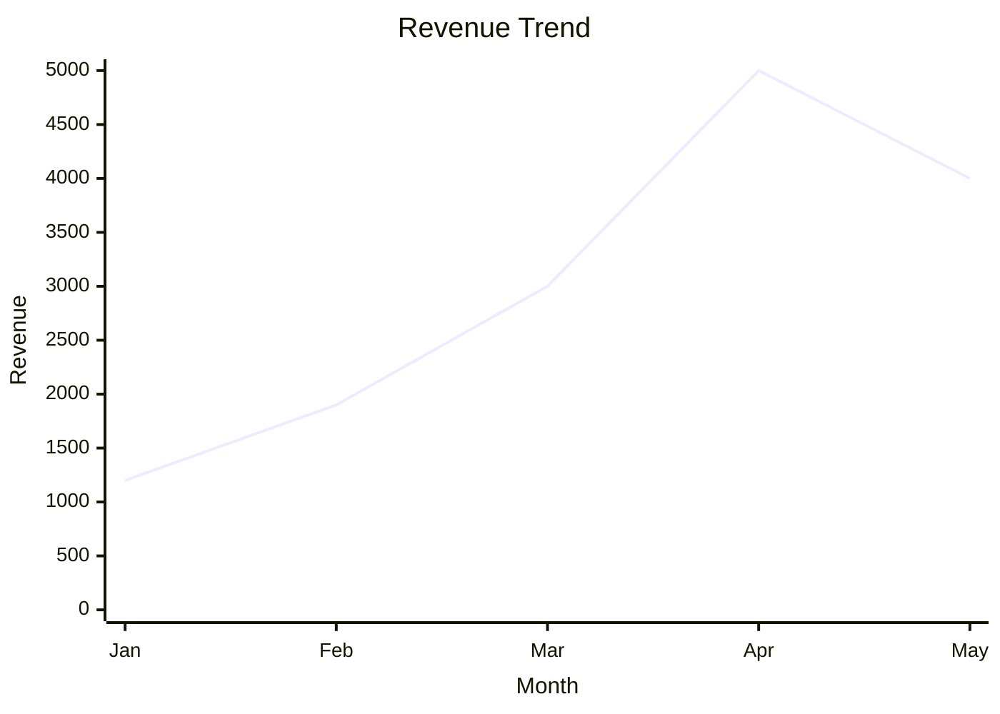
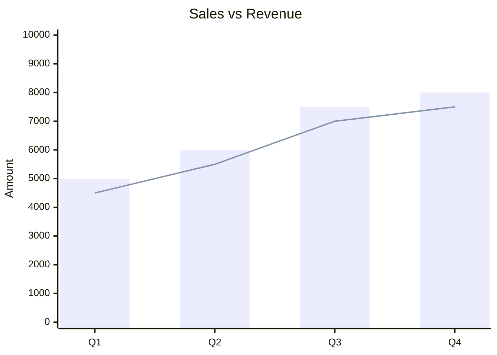

## Instructions

XY charts display data using X and Y axes, supporting bar charts and line charts. The XY chart module is designed to be dynamic and adaptable, with capacity for expansion to include additional chart types in the future.

### Syntax

- Use `xychart` keyword (not `xychart-beta`)
- Orientation: `xychart horizontal` (default is vertical)
- Title: `title "Chart Title"` (quotes needed if title has spaces)
- X-axis:
  - Numeric range: `x-axis title min --> max`
  - Categorical: `x-axis "title" [cat1, "cat2 with space", cat3]`
- Y-axis:
  - `y-axis title min --> max` (numeric range)
  - `y-axis title` (auto-generated range from data)
- Series:
  - `line [values]` - Line chart with numeric values
  - `bar [values]` - Bar chart with numeric values
- Multiple series can be defined
- **Simplest example**: Only chart name and one data set required

Reference: [Mermaid XY Chart Documentation](https://mermaid.ai/open-source/syntax/xyChart.html)

### Example (Simplest)



### Example (Bar Chart)



### Example (Line Chart)



### Example (Multiple Series)



### Example (Horizontal Orientation)

```mermaid
xychart horizontal
    title "Product Comparison"
    x-axis "Score" 0 --> 100
    y-axis [Product A, Product B, Product C]
    bar [85, 70, 90]
```

### Example (Numeric X-axis Range)

```mermaid
xychart
    title "Function Plot"
    x-axis "X" 0 --> 10
    y-axis "Y" -5 --> 5
    line [0, 1, 2, 3, 4, 5, 4, 3, 2, 1, 0]
```
