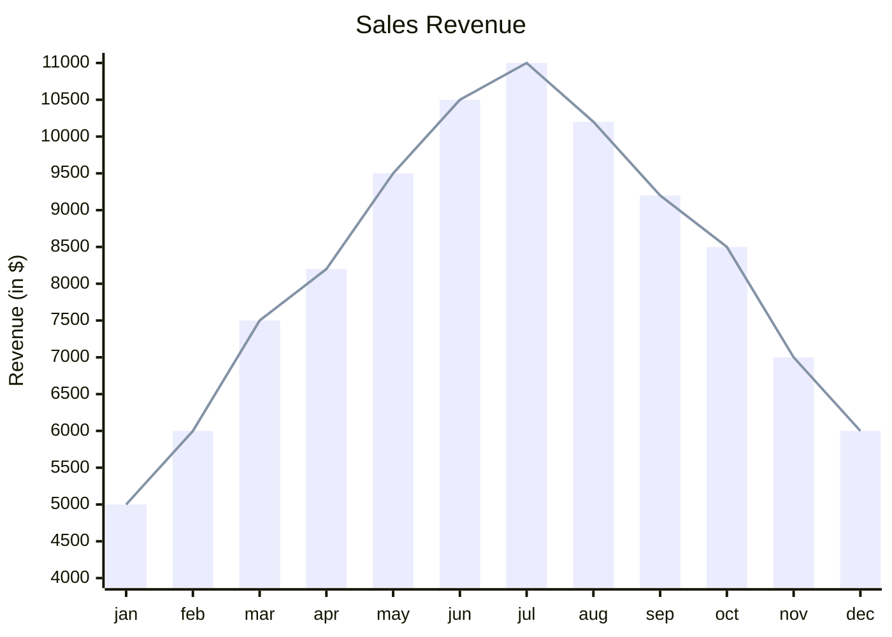
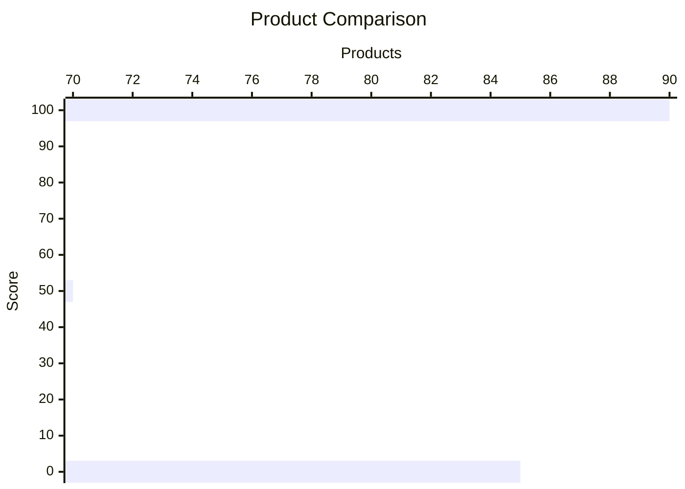
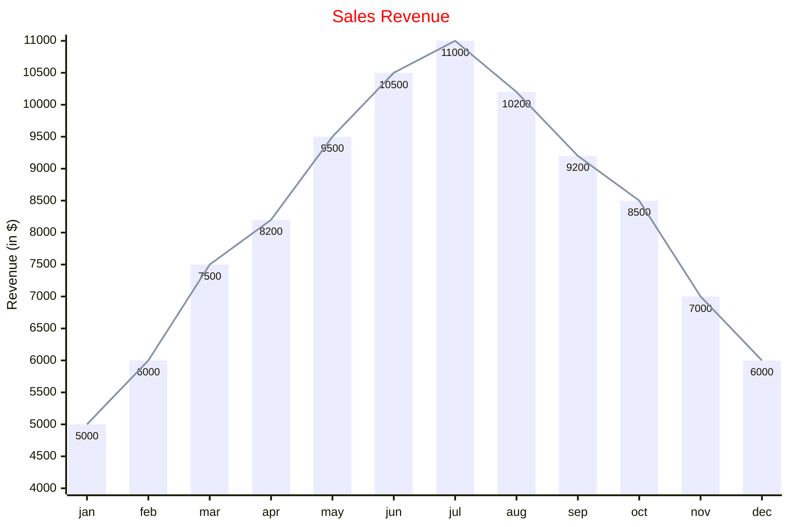
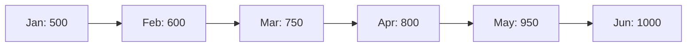

## Instructions

XY charts display data using X and Y axes, supporting bar charts and line charts. The XY chart module is designed to be dynamic and adaptable, with capacity for expansion to include additional chart types in the future.

### Syntax

- Use `xychart` keyword (not `xychart-beta`)
- Orientation: `xychart horizontal` (default is vertical)
- Title: `title "Chart Title"` (quotes needed if title has spaces)
- X-axis:
  - Numeric range: `x-axis title min --> max`
  - Categorical: `x-axis "title" [cat1, "cat2 with space", cat3]`
- Y-axis:
  - `y-axis title min --> max` (numeric range)
  - `y-axis title` (auto-generated range from data)
- Series:
  - `line [values]` - Line chart with numeric values
  - `bar [values]` - Bar chart with numeric values
- Multiple series can be defined
- Configuration: `width`, `height`, `titlePadding`, `titleFontSize`, `showTitle`, `xAxis`, `yAxis`, `chartOrientation`, `plotReservedSpacePercent`, `showDataLabel`
- Theme variables: `backgroundColor`, `titleColor`, `xAxisLabelColor`, `xAxisTitleColor`, `xAxisTickColor`, `xAxisLineColor`, `yAxisLabelColor`, `yAxisTitleColor`, `yAxisTickColor`, `yAxisLineColor`, `plotColorPalette`

Reference: [Mermaid XY Chart Documentation](https://mermaid.js.org/syntax/xyChart.html)

### Example (Simplest)

The simplest example with only chart name and one data set:


### Example (Bar Chart)

A bar chart with categorical x-axis and numeric y-axis:


### Example (Line Chart)

A line chart with categorical x-axis:


### Example (Multiple Series)

Combine bar and line charts in one diagram:



### Example (Horizontal Orientation)

Horizontal chart orientation with numeric x-axis:



### Example (Numeric X-axis Range)

Use numeric range for x-axis:

```mermaid
xychart
    title "Function Plot"
    x-axis "X" 0 --> 10
    y-axis "Y" -5 --> 5
    line [0, 1, 2, 3, 4, 5, 4, 3, 2, 1, 0]
```

### Example (With Color Palette)

Set custom colors for lines and bars using plotColorPalette:

```mermaid
---
config:
  themeVariables:
    xyChart:
      plotColorPalette: '#000000, #0000FF, #00FF00, #FF0000'
---
xychart
title "Different Colors in xyChart"
x-axis "categoriesX" ["Category 1", "Category 2", "Category 3", "Category 4"]
y-axis "valuesY" 0 --> 50
%% Black line
line [10,20,30,40]
%% Blue bar
bar [20,30,25,35]
%% Green bar
bar [15,25,20,30]
%% Red line
line [5,15,25,35]
```



### Example (With Configuration and Theme)

Full configuration example with width, height, showDataLabel, and theme variables:



### Alternative (Flowchart - compatible with all Mermaid versions)

If XY charts are not supported, use this flowchart alternative:


