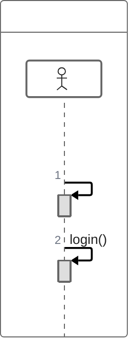
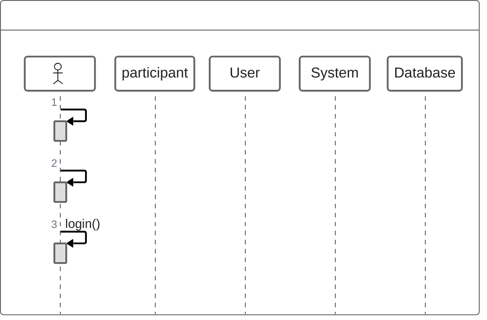
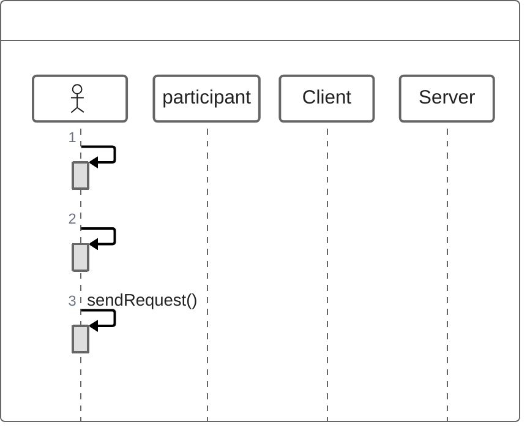
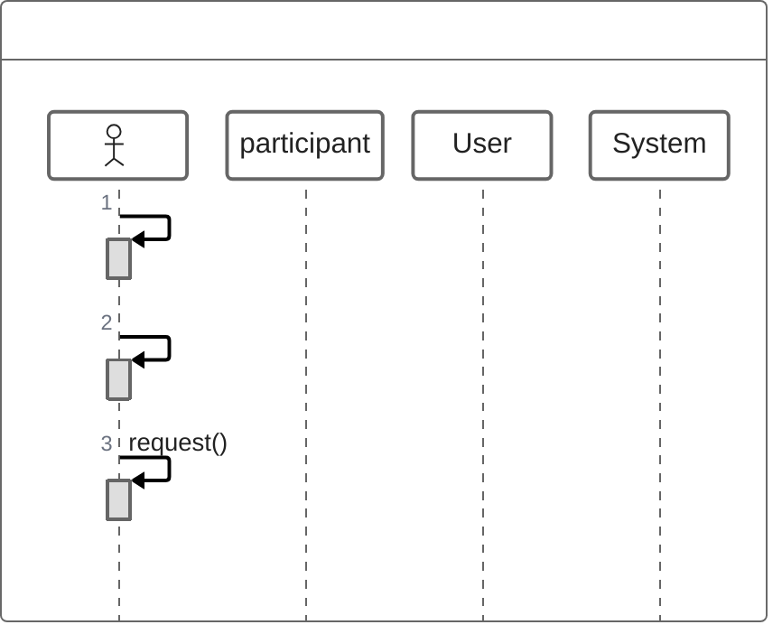
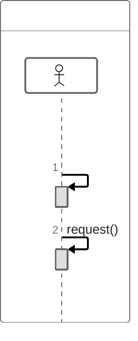
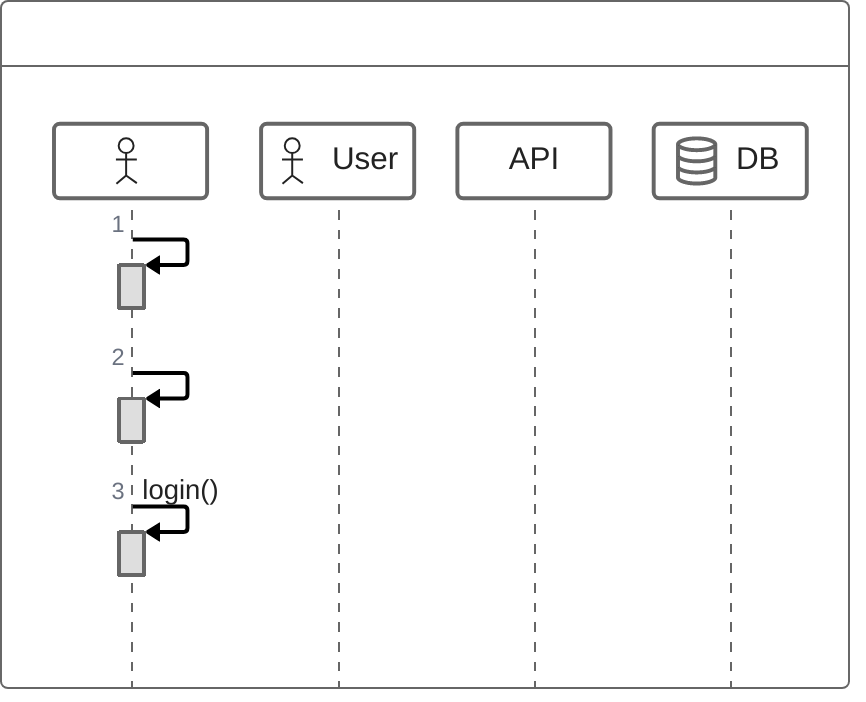
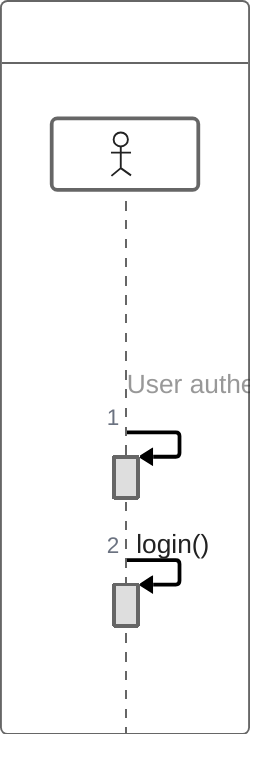
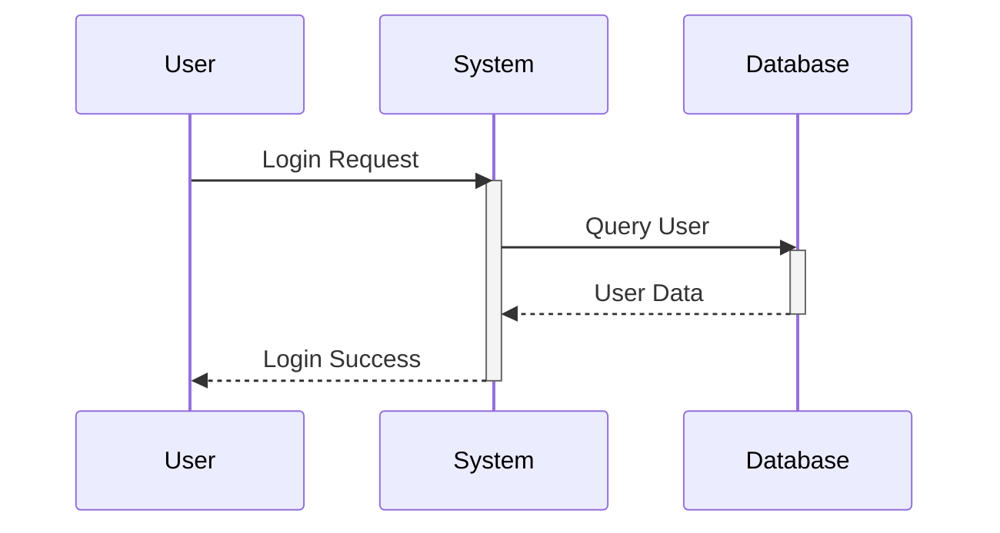

## Instructions

ZenUML provides a simplified way to create sequence diagrams with a more concise syntax than the original Sequence Diagram in Mermaid. A sequence diagram is an interaction diagram that shows how processes operate with one another and in what order.

### Syntax

- Use `zenuml` keyword
- Participants: Defined implicitly by order of appearance, or explicitly with `participant Name`
- Annotators: Use symbols instead of rectangles (e.g., `@Actor`, `@User`, `@Database`)
- Aliases: `participant Alias as "Label"`
- Messages:
  - Sync message: `Participant1.method() -> Participant2` (blocking)
  - Async message: `Participant1.method() => Participant2` (non-blocking)
  - Creation message: `new Participant()` (creates new object)
  - Reply message: `Participant2.result() -> Participant1` or `@return` or `return`
- Nesting: Sync and Creation messages are naturally nestable with `{}`
- Comments: `// comment` (Markdown supported)
- Control structures:
  - Loops: `while(condition)`, `for(condition)`, `forEach(condition)`, `loop(condition)`
  - Alt: `if(condition) { } else if(condition) { } else { }`
  - Opt: `opt { }`
  - Parallel: `par { statement1 statement2 }`
  - Try/Catch/Finally: `try { } catch { } finally { }`

Reference: [Mermaid ZenUML Documentation](https://mermaid.ai/open-source/syntax/zenuml.html)

### Example (Basic Sequence)

### Example (With Participants)

### Example (Sync and Async Messages)

### Example (With Nesting)

### Example (With Loops)

### Example (With Alt - Alternative Paths)

### Example (With Opt - Optional)

### Example (With Parallel)

### Example (With Try/Catch/Finally)

### Example (With Annotators)

### Example (With Comments)

### Alternative (Standard Sequence Diagram - compatible with all Mermaid versions)

If ZenUML is not supported, use the standard sequence diagram:

