## Instructions

ZenUML provides a simplified way to create sequence diagrams with a more concise syntax than the original Sequence Diagram in Mermaid. A sequence diagram is an interaction diagram that shows how processes operate with one another and in what order.

### Syntax

- Use `zenuml` keyword
- Title: `title Diagram Title` (optional)
- Participants: Defined implicitly by order of appearance, or explicitly with `participant Name`
- Annotators: Use symbols instead of rectangles (e.g., `@Actor`, `@User`, `@Database`)
- Aliases: `participant Alias as "Label"` or `A as Alice`
- Messages:
  - Sync message: `Participant1.method() -> Participant2` or `A.method()` (blocking)
  - Async message: `Participant1.method() => Participant2` or `Alice->Bob: message` (non-blocking)
  - Creation message: `new Participant()` (creates new object)
  - Reply message: `a = A.SyncMessage()`, `return result`, or `@return A->B: result`
- Nesting: Sync and Creation messages are naturally nestable with `{}`
- Comments: `// comment` (Markdown supported)
- Control structures:
  - Loops: `while(condition)`, `for(condition)`, `forEach(condition)`, `loop(condition)`
  - Alt: `if(condition) { } else if(condition) { } else { }`
  - Opt: `opt { }`
  - Parallel: `par { statement1 statement2 }`
  - Try/Catch/Finally: `try { } catch { } finally { }`

Reference: [Mermaid ZenUML Documentation](https://mermaid.js.org/syntax/zenuml.html)

### Example (Basic Sequence)

A simple sequence diagram with implicit participants:

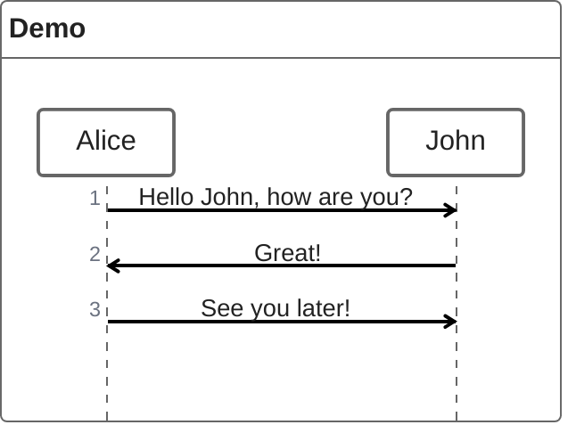

### Example (With Participants)

Declare participants explicitly to control their order:

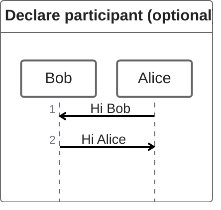

### Example (With Annotators)

Use annotators to show symbols instead of rectangles:

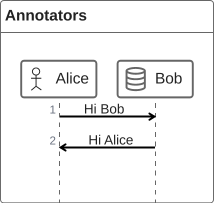

### Example (With Aliases)

Use aliases for convenient identifiers with descriptive labels:

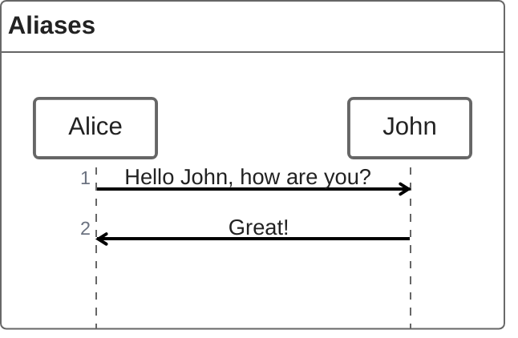

### Example (Sync Message)

Sync (blocking) messages with nesting:

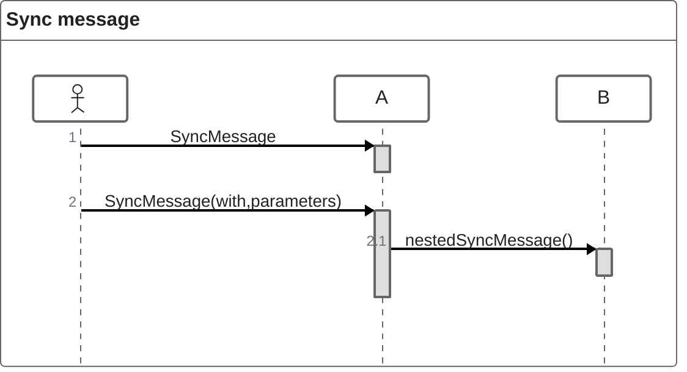

### Example (Async Message)

Async (non-blocking) messages:

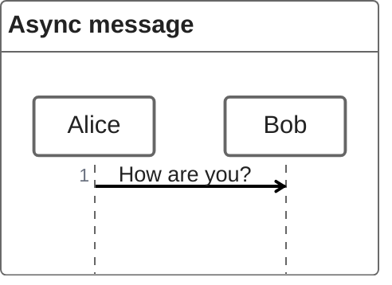

### Example (Creation Message)

Create new objects using the new keyword:

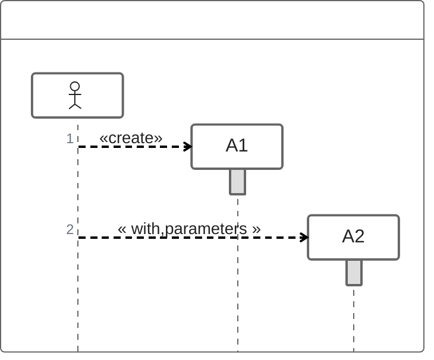

### Example (Reply Message - Three Ways)

Three ways to express reply messages:

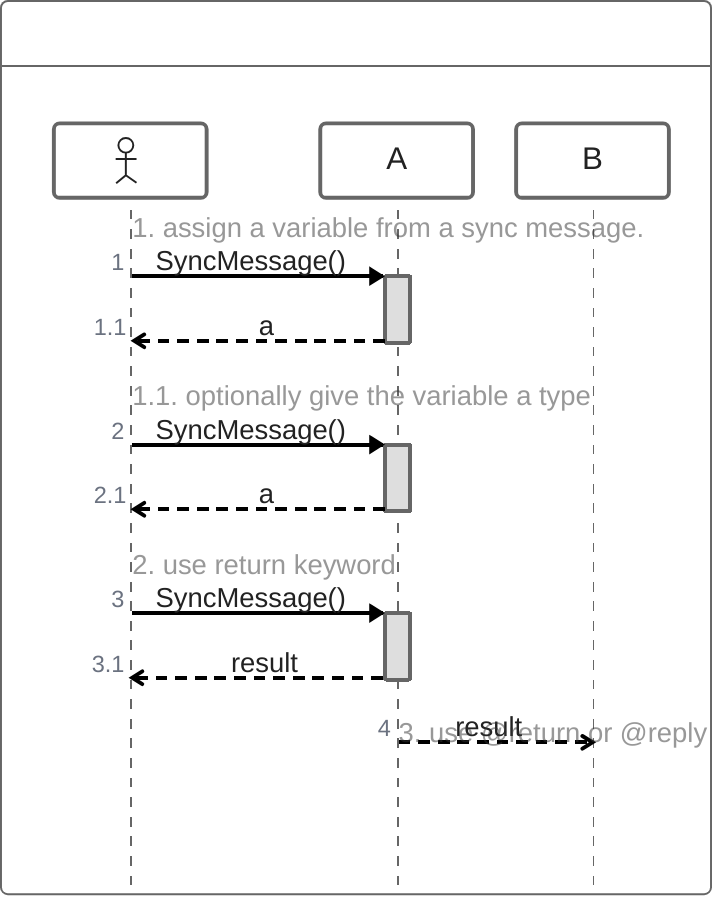

### Example (Reply Message - Complex)

Complex reply message with early return:

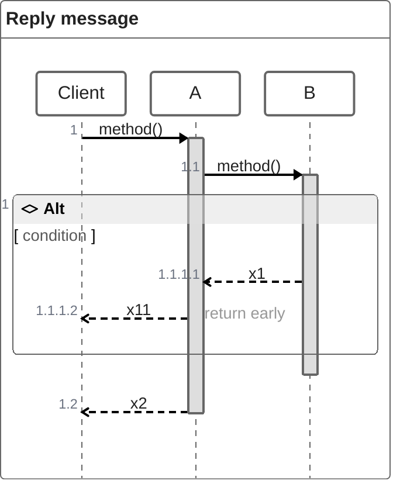

### Example (With Nesting)

Nest sync messages naturally with braces:

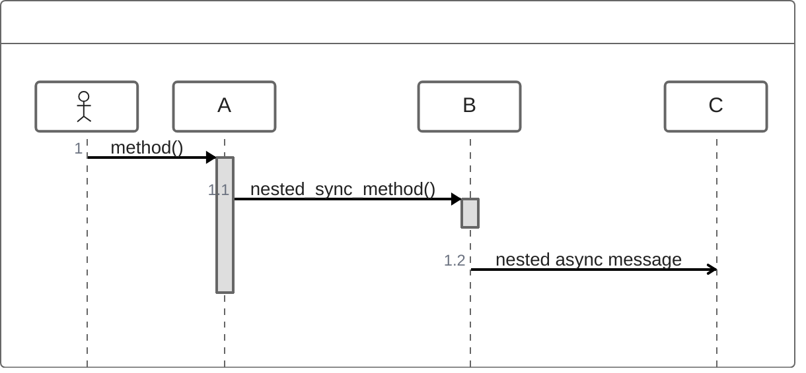

### Example (With Comments)

Add comments with Markdown support:

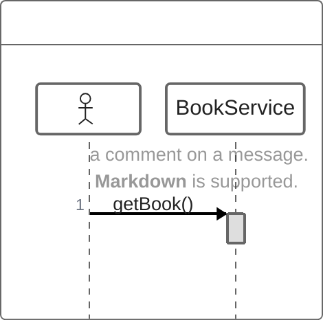

### Example (With Loops)

Express loops using while, for, forEach, or loop:

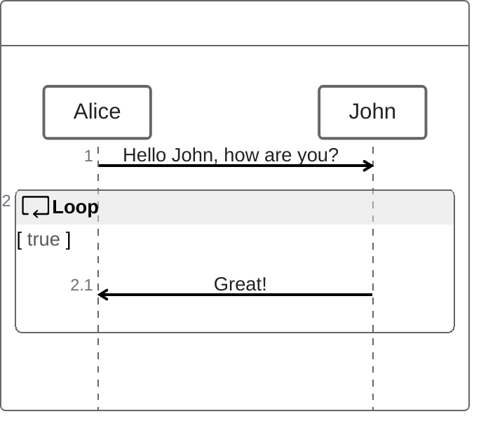

### Example (With Alt - Alternative Paths)

Express alternative paths with if/else:

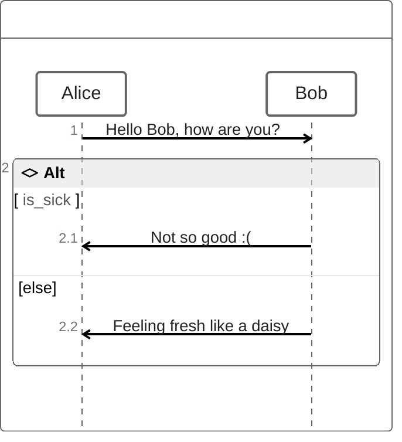

### Example (With Opt - Optional)

Render optional fragments:

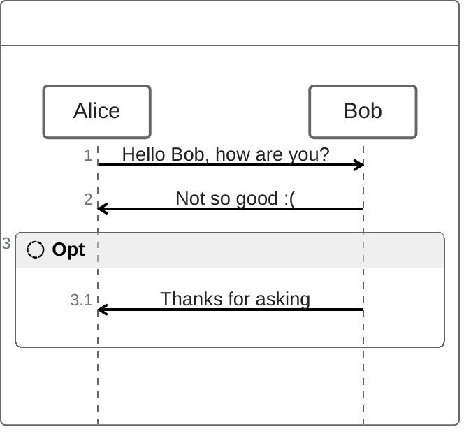

### Example (With Parallel)

Show actions happening in parallel:

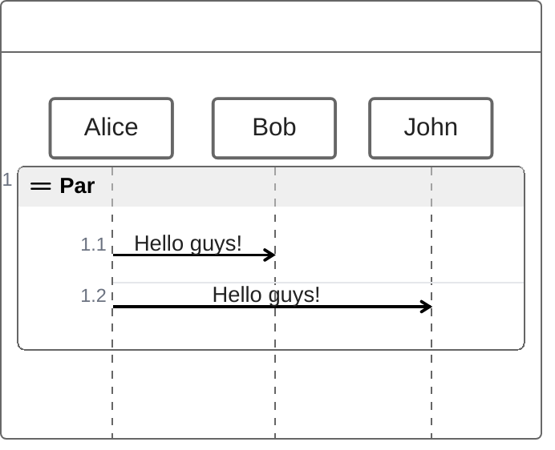

### Example (With Try/Catch/Finally)

Indicate exception handling with try/catch/finally:

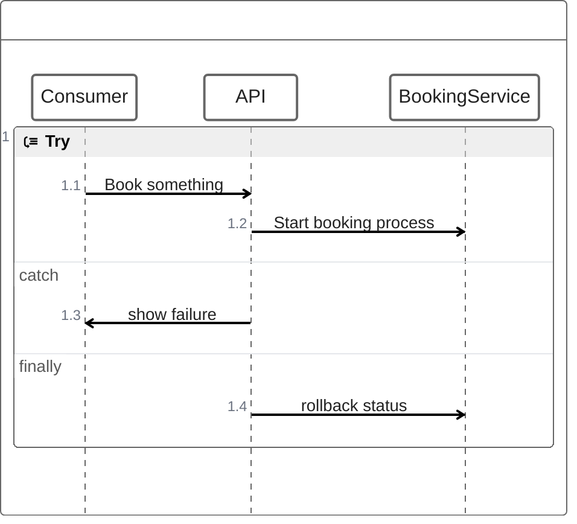

### Alternative (Standard Sequence Diagram - compatible with all Mermaid versions)

If ZenUML is not supported, use the standard sequence diagram:

