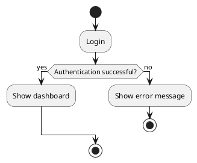
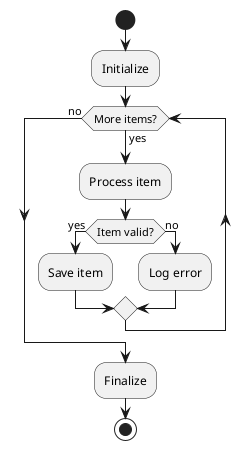
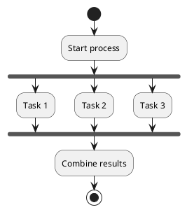
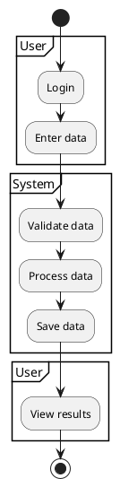
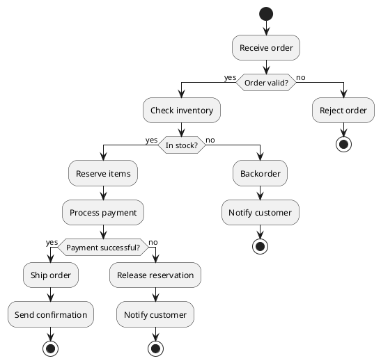

# Activity Diagram | 活动图

**官方文档**: https://plantuml.com/zh/activity-diagram-legacy

## Instructions

Activity diagrams show workflows and business processes. They are useful for modeling the flow of control from activity to activity.

## Key Concepts

- Use `@startuml` and `@enduml` to wrap the diagram
- Use `start` and `stop` for start and end nodes
- Use `:` for activities
- Use `if`, `then`, `else`, `endif` for decisions
- Use `while`, `endwhile` for loops
- Use `fork`, `fork again`, `end fork` for parallel activities
- Use `partition` to group activities
- Use `note` for annotations

## Example: Basic Activity Diagram

## Example: With Decisions and Loops

## Example: With Parallel Activities

## Example: With Partitions

## Example: Complex Workflow

## Key Points

- Use `start` and `stop` for start and end nodes
- Use `:` for activity labels
- Use `if`, `then`, `else`, `endif` for decision nodes
- Use `while`, `endwhile` for loops
- Use `fork`, `fork again`, `end fork` for parallel execution
- Use `partition` to group related activities
- Use `note` for annotations
- Activities are connected automatically in sequence
