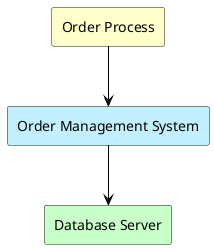
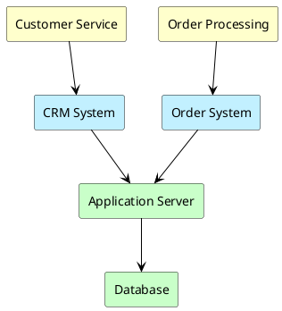
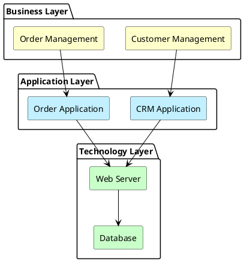

# Archimate Diagram | Archimate 架构图

**官方文档**: https://plantuml.com/zh/archimate-diagram

## Instructions

Archimate diagrams model enterprise architecture using the ArchiMate standard. They are useful for enterprise architecture documentation.

## Key Concepts

- Use `@startuml` and `@enduml` to wrap the diagram
- Use ArchiMate elements: Application, Business, Technology layers
- Use relationships to show dependencies
- Follow ArchiMate notation standards

## Example: Basic Archimate Diagram

## Example: Three-Layer Architecture

## Example: Enterprise Architecture

## Key Points

- Use `!include <archimate/Archimate>` to include ArchiMate library
- Use `archimate` keyword for ArchiMate elements
- Use color codes: `#Business`, `#Application`, `#Technology`
- ArchiMate diagrams follow enterprise architecture standards
- ArchiMate diagrams are ideal for enterprise architecture documentation
