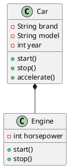
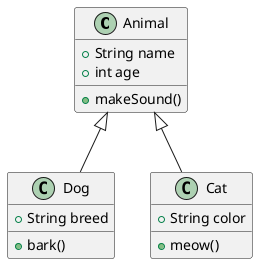
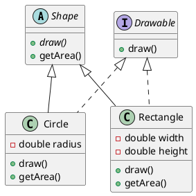
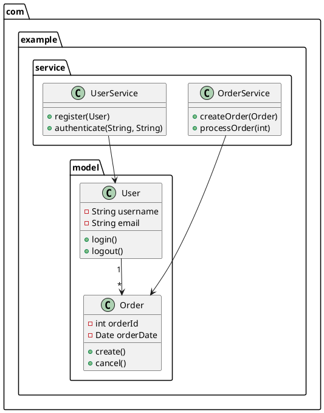
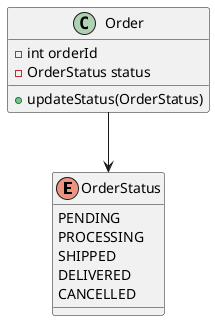

# Class Diagram | 类图

**官方文档**: https://plantuml.com/zh/class-diagram

## Instructions

Class diagrams show the structure of a system by modeling classes, their attributes, methods, and relationships. They are essential for object-oriented design and documentation.

## Key Concepts

- Use `@startuml` and `@enduml` to wrap the diagram
- Define classes with `class` keyword
- Use visibility modifiers: `+` (public), `-` (private), `#` (protected), `~` (package)
- Define relationships: `--`, `-->`, `<|--`, `*--`, `o--`, etc.
- Use `abstract`, `interface`, `enum` for special class types
- Use `package` to group related classes
- Use `note` for annotations

## Example: Basic Class Diagram

## Example: With Relationships

## Example: With Interfaces and Abstract Classes

## Example: With Packages

## Example: With Enums

## Relationship Types

- `--` : Association
- `-->` : Directed association
- `<|--` : Inheritance (extends)
- `*--` : Composition
- `o--` : Aggregation
- `..>` : Dependency
- `<|..` : Implementation (implements)

## Key Points

- Use visibility modifiers: `+` (public), `-` (private), `#` (protected), `~` (package)
- Use `abstract` for abstract classes, `interface` for interfaces
- Use `{abstract}` for abstract methods
- Use `package` to organize classes
- Use relationship arrows to show class relationships
- Use `note` for additional documentation
- Use `enum` for enumeration types
