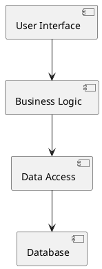
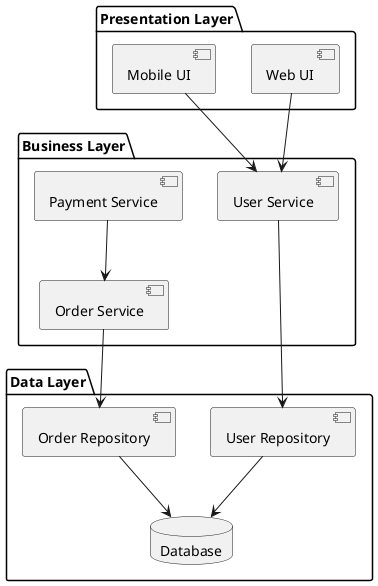

# Component Diagram | 组件图

**官方文档**: https://plantuml.com/zh/component-diagram

## Instructions

Component diagrams show the structure of a system by modeling components, interfaces, and their relationships. They are useful for system architecture documentation.

## Key Concepts

- Use `@startuml` and `@enduml` to wrap the diagram
- Define components with `component` keyword
- Define interfaces with `interface` keyword
- Use `package` to group components
- Use relationships: `--`, `-->`, `<|--`, `..>`, etc.
- Use `note` for annotations

## Example: Basic Component Diagram



## Example: With Interfaces

```plantuml
@startuml
interface IUserService
interface IOrderService

component [User Module] {
  component [UserController]
  component [UserService]
}

component [Order Module] {
  component [OrderController]
  component [OrderService]
}

component [Database] as DB

UserController --> IUserService
UserService ..|> IUserService
UserService --> DB

OrderController --> IOrderService
OrderService ..|> IOrderService
OrderService --> DB
@enduml
```

## Example: With Packages



## Example: Microservices Architecture

```plantuml
@startuml
component [API Gateway] as Gateway

package "User Service" {
  component [User API]
  component [User Service]
  database "User DB"
}

package "Order Service" {
  component [Order API]
  component [Order Service]
  database "Order DB"
}

package "Payment Service" {
  component [Payment API]
  component [Payment Service]
  database "Payment DB"
}

Gateway --> [User API]
Gateway --> [Order API]
Gateway --> [Payment API]

[User API] --> [User Service]
[Order API] --> [Order Service]
[Payment API] --> [Payment Service]

[User Service] --> "User DB"
[Order Service] --> "Order DB"
[Payment Service] --> "Payment DB"

[Order Service] --> [User Service]
[Order Service] --> [Payment Service]
@enduml
```

## Key Points

- Use `component` to define components
- Use `interface` to define interfaces
- Use `package` to group related components
- Use `database` for database components
- Use `-->` for dependencies
- Use `..|>` for interface implementation
- Use `note` for additional documentation
- Component diagrams are ideal for system architecture documentation
