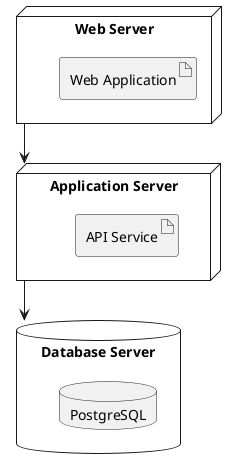
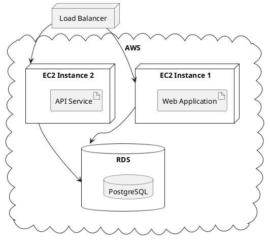
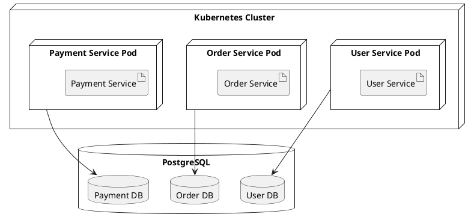

# Deployment Diagram | 部署图

**官方文档**: https://plantuml.com/zh/deployment-diagram

## Instructions

Deployment diagrams show the physical architecture of a system, including nodes, artifacts, and their relationships. They are useful for infrastructure documentation.

## Key Concepts

- Use `@startuml` and `@enduml` to wrap the diagram
- Use `node` to define deployment nodes
- Use `database` for database nodes
- Use `cloud` for cloud nodes
- Use `package` to group nodes
- Use relationships: `--`, `-->`, etc.
- Use `note` for annotations

## Example: Basic Deployment Diagram

## Example: Cloud Deployment

## Example: Microservices Deployment

## Key Points

- Use `node` to define deployment nodes
- Use `artifact` to define software artifacts
- Use `database` for database nodes
- Use `cloud` for cloud infrastructure
- Use `package` to group related nodes
- Use `-->` for dependencies between nodes
- Deployment diagrams are ideal for infrastructure documentation
