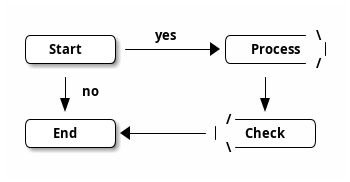
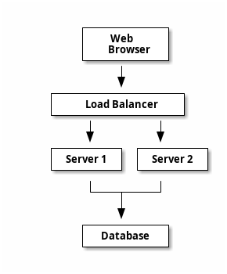

# Ditaa Diagram | Ditaa 图

**官方文档**: https://plantuml.com/zh/ditaa

## Instructions

Ditaa diagrams create ASCII art diagrams that are rendered as images. They are useful for creating simple diagrams with text-based syntax.

## Key Concepts

- Use `@startditaa` and `@endditaa` to wrap the diagram
- Use ASCII characters to draw diagrams
- Supports boxes, arrows, and text
- Renders as image output

## Example: Basic Ditaa Diagram

## Example: Flowchart

## Example: System Architecture

## Key Points

- Use `@startditaa` and `@endditaa` for Ditaa diagrams
- Use ASCII characters to draw diagrams
- Ditaa renders ASCII art as images
- Ditaa diagrams are ideal for simple text-based diagrams
