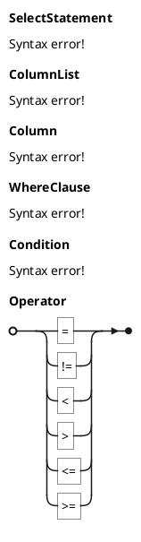

# EBNF Diagram | EBNF 图

**官方文档**: https://plantuml.com/zh/ebnf

## Instructions

EBNF (Extended Backus-Naur Form) diagrams visualize grammar rules and syntax definitions. They are useful for documenting programming languages, data formats, and protocols.

## Key Concepts

- Use `@startebnf` and `@endebnf` to wrap the diagram
- Define grammar rules with `=` for definitions
- Use `|` for alternatives
- Use `*` for zero or more, `+` for one or more, `?` for optional

## Example: Basic EBNF Diagram

```plantuml
@startebnf
Expression = Term | Expression "+" Term | Expression "-" Term;
Term = Factor | Term "*" Factor | Term "/" Factor;
Factor = Number | "(" Expression ")";
Number = Digit+;
Digit = "0" | "1" | "2" | "3" | "4" | "5" | "6" | "7" | "8" | "9";
@endebnf
```

## Example: JSON Grammar

```plantuml
@startebnf
JSON = Value;
Value = Object | Array | String | Number | Boolean | Null;
Object = "{" [Pair ("," Pair)*] "}";
Pair = String ":" Value;
Array = "[" [Value ("," Value)*] "]";
String = "\"" Character* "\"";
Number = Integer [Fraction] [Exponent];
Boolean = "true" | "false";
Null = "null";
@endebnf
```

## Example: SQL SELECT Statement



## Key Points

- Use `@startebnf` and `@endebnf` for EBNF diagrams
- Use `=` for rule definitions
- Use `|` for alternatives
- Use `*` for zero or more, `+` for one or more, `?` for optional
- EBNF diagrams are ideal for documenting grammars and syntax
