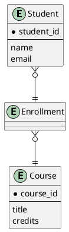
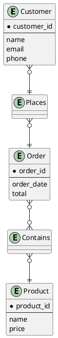

# ER Diagram (Chen's Notation) | ER 图（陈氏表示法）

**官方文档**: https://plantuml.com/zh/ie-diagram

## Instructions

ER diagrams using Chen's notation show entities, attributes, and relationships in a different visual style. They are useful for conceptual data modeling.

## Key Concepts

- Use `@startuml` and `@enduml` to wrap the diagram
- Use Chen's notation style for entities and relationships
- Entities are shown as rectangles
- Relationships are shown as diamonds
- Attributes are shown as ovals

## Example: Basic Chen's Notation

## Example: Complex Chen's Notation

## Key Points

- Chen's notation uses different visual style
- Entities are rectangles
- Relationships are diamonds
- Attributes are ovals
- Chen's notation is ideal for conceptual modeling
