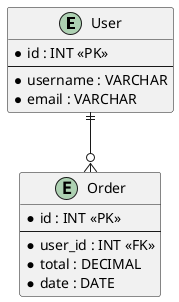
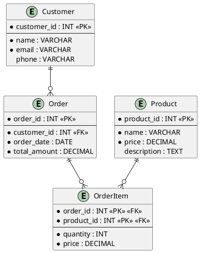
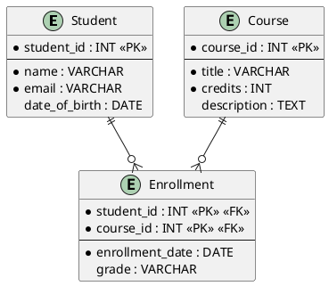

# ER Diagram | 实体关系图

**官方文档**: https://plantuml.com/zh/ie-diagram

## Instructions

ER (Entity-Relationship) diagrams show entities and their relationships. They are useful for database design and data modeling.

## Key Concepts

- Use `@startuml` and `@enduml` to wrap the diagram
- Use `entity` to define entities
- Use relationships: `||--`, `}o--`, `}--`, etc.
- Use `(`, `)` for cardinality notation

## Example: Basic ER Diagram

## Example: Complex ER Diagram

## Example: With Attributes

## Key Points

- Use `entity` to define entities
- Use `*` for primary keys, `--` for separator
- Use `||--`, `}o--`, `}--` for relationships
- Use `(`, `)` for cardinality notation
- ER diagrams are ideal for database design
