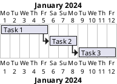
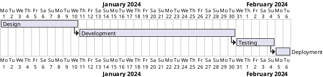
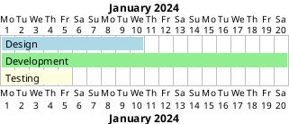

# Gantt Chart | 甘特图

**官方文档**: https://plantuml.com/zh/gantt-diagram

## Instructions

Gantt charts show project schedules and timelines. They are useful for project management and planning.

## Key Concepts

- Use `@startgantt` and `@endgantt` to wrap the diagram
- Use `project starts` to define project start date
- Use `sprint` to define sprints
- Use `[Task]` to define tasks
- Use `--` for task dependencies
- Use `starts`, `ends`, `happens` for date constraints
- Use `colors` for styling

## Example: Basic Gantt Chart



## Example: With Dates



## Example: With Sprints

```plantuml
@startgantt
project starts 2024-01-01
sprint starts 2024-01-01
sprint ends 2024-01-14

[User Stories] lasts 5 days
[Development] lasts 8 days
[Testing] lasts 3 days

sprint starts 2024-01-15
sprint ends 2024-01-28

[More Development] lasts 10 days
[More Testing] lasts 4 days

[User Stories] -> [Development]
[Development] -> [Testing]
[Testing] -> [More Development]
[More Development] -> [More Testing]
@endgantt
```

## Example: With Colors



## Key Points

- Use `@startgantt` and `@endgantt` for Gantt charts
- Use `project starts` to define project start date
- Use `[Task]` to define tasks with durations
- Use `->` for task dependencies
- Use `sprint` to define sprints
- Use `is colored in` for styling
- Gantt charts are ideal for project management
