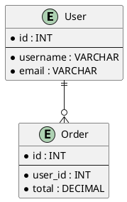
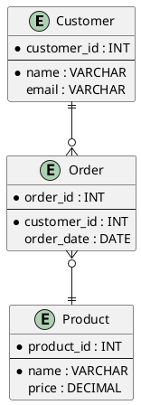

# IE Diagram | 信息工程图

**官方文档**: https://plantuml.com/zh/ie-diagram

## Instructions

IE (Information Engineering) diagrams use Crow's Foot notation for entity relationships. They are useful for database design with standard IE notation.

## Key Concepts

- Use `@startuml` and `@enduml` to wrap the diagram
- Use `entity` to define entities
- Use IE notation for relationships
- Follow Information Engineering standards

## Example: Basic IE Diagram

## Example: With Cardinality

## Key Points

- Use `entity` for entities
- IE diagrams use Crow's Foot notation
- Use `||--`, `}o--`, etc. for relationships
- IE diagrams follow Information Engineering standards
