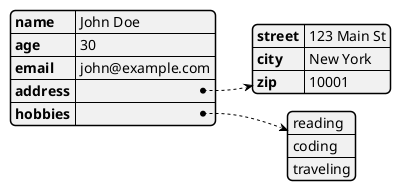
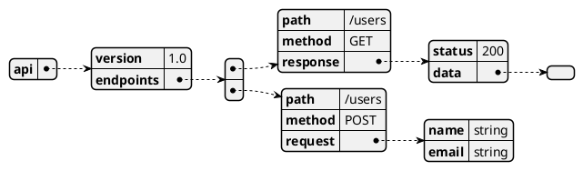

# JSON/YAML Data Diagram | JSON/YAML 数据图

**官方文档**: https://plantuml.com/zh/json

## Instructions

JSON and YAML diagrams visualize structured data in a tree format. They are useful for documenting data structures and configurations.

## Key Concepts

- Use `@startjson` and `@endjson` for JSON diagrams
- Use `@startyaml` and `@endyaml` for YAML diagrams
- Data is displayed in a hierarchical tree structure
- Supports nested objects and arrays

## Example: JSON Diagram

## Example: YAML Diagram

## Example: Complex JSON Structure

## Key Points

- Use `@startjson` and `@endjson` for JSON data
- Use `@startyaml` and `@endyaml` for YAML data
- Data is automatically formatted as a tree
- Supports nested structures and arrays
- JSON/YAML diagrams are ideal for documenting data structures
