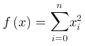
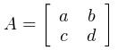

# Mathematical Notations | 数学公式图

**官方文档**: https://plantuml.com/zh/ascii-math

## Instructions

Mathematical notation diagrams render mathematical formulas using AsciiMath or LaTeX syntax. They are useful for documenting mathematical concepts and equations.

## Key Concepts

- Use `@startmath` and `@endmath` for AsciiMath
- Use `@startlatex` and `@endlatex` for LaTeX
- Supports mathematical expressions and formulas
- Renders as formatted mathematical notation

## Example: AsciiMath

## Example: LaTeX

```plantuml
@startlatex
\[
\int_{-\infty}^{\infty} e^{-x^2} dx = \sqrt{\pi}
\]
@endlatex
```

## Example: Complex Formula

```plantuml
@startmath
E = mc^2
@endmath
```

## Example: Matrix

## Key Points

- Use `@startmath` and `@endmath` for AsciiMath notation
- Use `@startlatex` and `@endlatex` for LaTeX notation
- Mathematical notation diagrams render formulas
- Mathematical notation diagrams are ideal for mathematical documentation
