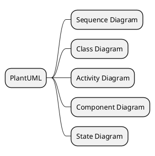
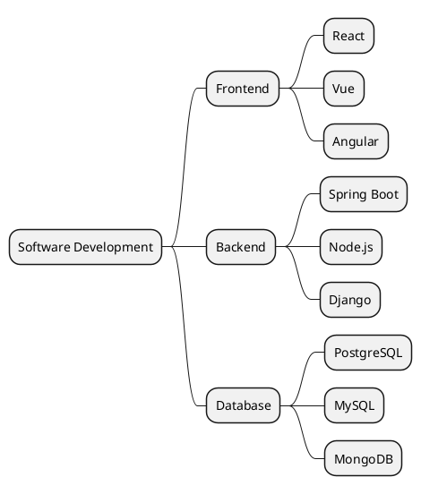
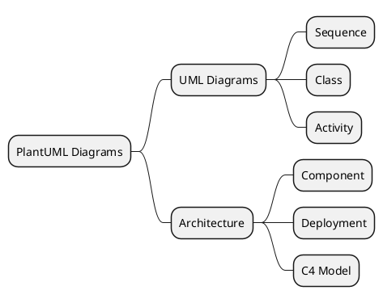

# Mindmap | 思维导图

**官方文档**: https://plantuml.com/zh/mindmap-diagram

## Instructions

Mindmaps show hierarchical information in a tree structure. They are useful for brainstorming, note-taking, and organizing ideas.

## Key Concepts

- Use `@startmindmap` and `@endmindmap` to wrap the diagram
- Use `*` for root node
- Use `**` for second level nodes
- Use `***` for third level nodes, etc.
- Use `+` for left side, `-` for right side (optional)
- Use `:` for styling

## Example: Basic Mindmap

## Example: With Multiple Levels

## Example: With Styling

## Key Points

- Use `@startmindmap` and `@endmindmap` for mindmaps
- Use `*` for root node
- Use `**`, `***`, etc. for nested levels
- Mindmaps are ideal for organizing hierarchical information
