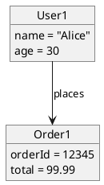
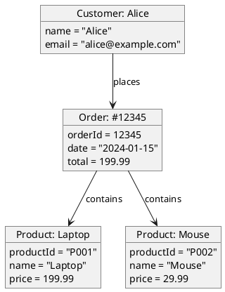
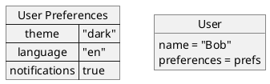

# Object Diagram | 对象图

**官方文档**: https://plantuml.com/zh/object-diagram

## Instructions

Object diagrams show instances of classes and their relationships at a specific point in time. They are useful for modeling the runtime structure of a system.

## Key Concepts

- Use `@startuml` and `@enduml` to wrap the diagram
- Use `object` to define objects
- Use `map` for key-value pairs
- Use relationships: `--`, `-->`, etc.
- Use `note` for annotations

## Example: Basic Object Diagram

## Example: With Multiple Objects

## Example: With Maps

## Key Points

- Use `object` to define object instances
- Use `map` for key-value pairs
- Object diagrams show runtime instances, not classes
- Use relationships to show object connections
- Object diagrams are ideal for modeling specific system states
