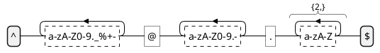
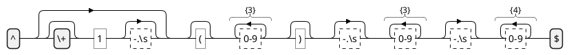
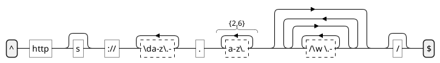
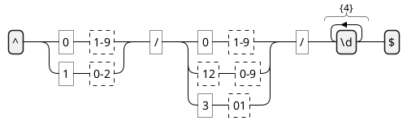

# Regex Diagram | 正则表达式图

**官方文档**: https://plantuml.com/zh/regex

## Instructions

Regex diagrams visualize regular expressions as state machines. They are useful for understanding and documenting complex regular expressions.

## Key Concepts

- Use `@startregex` and `@endregex` to wrap the diagram
- Regular expression syntax is automatically parsed
- Shows state transitions and matching paths
- Supports common regex patterns

## Example: Basic Regex Diagram

## Example: Phone Number Pattern

## Example: URL Pattern

## Example: Date Pattern

## Key Points

- Use `@startregex` and `@endregex` for regex diagrams
- Regular expressions are automatically parsed and visualized
- Shows state machine representation of regex patterns
- Regex diagrams are ideal for understanding complex patterns
