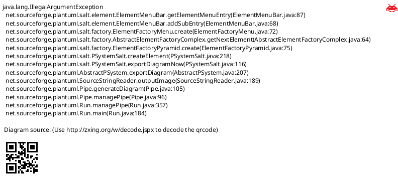
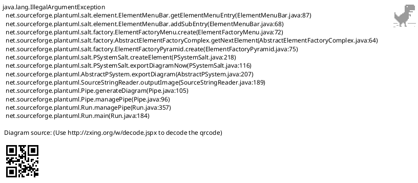
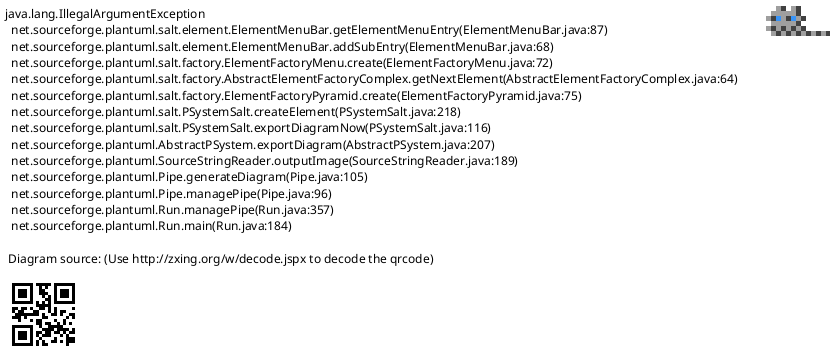

# Salt Wireframe | Salt 线框图

**官方文档**: https://plantuml.com/zh/salt

## Instructions

Salt diagrams create wireframe mockups of user interfaces. They are useful for UI/UX design and prototyping.

## Key Concepts

- Use `@startsalt` and `@endsalt` to wrap the diagram
- Use UI elements: buttons, text fields, labels, etc.
- Use layout commands for positioning
- Supports common UI components

## Example: Basic Login Form

## Example: Web Page Layout

## Example: Dashboard

## Example: Mobile App Screen

## Key Points

- Use `@startsalt` and `@endsalt` for wireframe diagrams
- Use `{*` for sections and `}` for closing
- Use `|` for horizontal layout, `--` for vertical layout
- Use `[` and `]` for buttons and input fields
- Salt diagrams are ideal for UI mockups and prototyping
