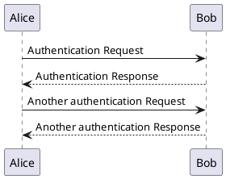
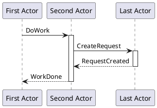
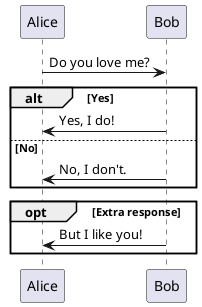
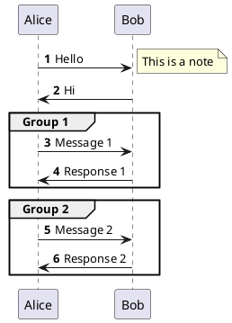
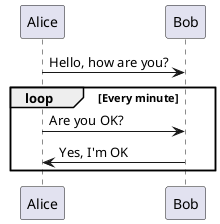

# Sequence Diagram | 时序图

**官方文档**: https://plantuml.com/zh/sequence-diagram

## Instructions

Sequence diagrams show interactions between objects or components over time. They are ideal for visualizing the flow of messages between actors, systems, or components.

## Key Concepts

- Use `@startuml` and `@enduml` to wrap the diagram
- Declare participants with `participant` or `actor`
- Use arrows (`->`, `-->`, `->>`, `-->>`) to show messages
- Use `activate` and `deactivate` to show activation boxes
- Use `alt`, `opt`, `loop`, `par`, `break`, `critical`, `group` for control structures
- Use `note` for annotations
- Use `autonumber` for automatic message numbering

## Example: Basic Sequence Diagram

## Example: With Participants

## Example: With Control Structures

## Example: With Notes and Groups

## Example: With Loops

## Key Points

- Use `participant` for regular participants, `actor` for actors
- Use `->` for synchronous messages, `-->` for return messages
- Use `->>` for asynchronous messages, `-->>` for asynchronous return
- Use `activate` and `deactivate` to show activation boxes
- Use control structures (`alt`, `opt`, `loop`, `par`, etc.) for complex flows
- Use `autonumber` to automatically number messages
- Use `note` for annotations on the left or right side
- Use `group` to organize related messages
