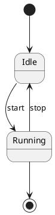
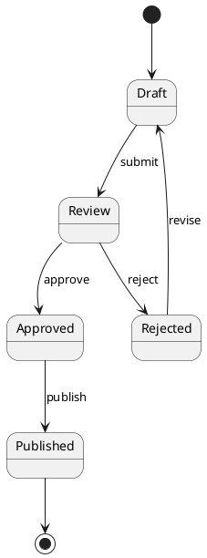
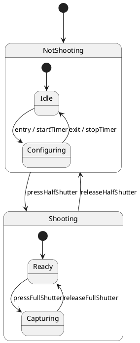
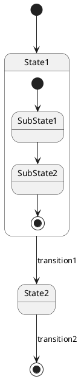

# State Diagram | 状态图

**官方文档**: https://plantuml.com/zh/state-diagram

## Instructions

State diagrams show the states of an object and the transitions between states. They are useful for modeling state machines and object lifecycles.

## Key Concepts

- Use `@startuml` and `@enduml` to wrap the diagram
- Use `[*]` for start and end states
- Use `state` to define states
- Use `-->` for transitions
- Use `:` for transition labels
- Use `note` for annotations
- Use nested states with `state` blocks

## Example: Basic State Diagram



## Example: With Multiple States



## Example: With Nested States



## Example: With Entry and Exit Actions



## Example: Order State Machine

```plantuml
@startuml
[*] --> Created : create order

state Created {
  [*]
}

Created --> Pending : submit
state Pending {
  [*]
}

Pending --> Processing : process
state Processing {
  [*]
}

Processing --> Shipped : ship
state Shipped {
  [*]
}

Shipped --> Delivered : deliver
state Delivered {
  [*]
}

Pending --> Cancelled : cancel
Processing --> Cancelled : cancel
Cancelled --> [*]

Delivered --> [*]
@enduml
```

## Key Points

- Use `[*]` for start and end states
- Use `state` to define states
- Use `-->` for transitions with optional labels
- Use nested `state` blocks for composite states
- Use entry/exit actions with `/` syntax
- Use `note` for annotations
- State diagrams are ideal for modeling state machines and object lifecycles
