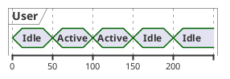
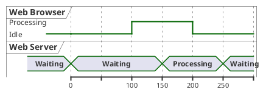
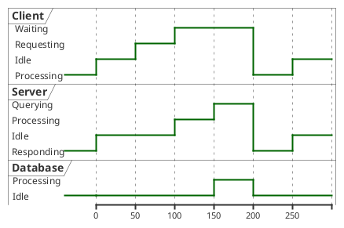

# Timing Diagram | 时序图

**官方文档**: https://plantuml.com/zh/timing-diagram

## Instructions

Timing diagrams show the state of objects or interactions over time. They are useful for modeling real-time systems and timing constraints.

## Key Concepts

- Use `@startuml` and `@enduml` to wrap the diagram
- Use `concise` for concise timing diagrams
- Use `robust` for robust timing diagrams
- Define states and transitions
- Show timing constraints

## Example: Concise Timing Diagram

## Example: Robust Timing Diagram

## Example: With Multiple Participants

## Key Points

- Use `concise` for simple timing diagrams
- Use `robust` for complex timing diagrams with multiple states
- Timing diagrams show state changes over time
- Use `@` to define state sequences for each participant
- Timing diagrams are ideal for real-time system modeling
