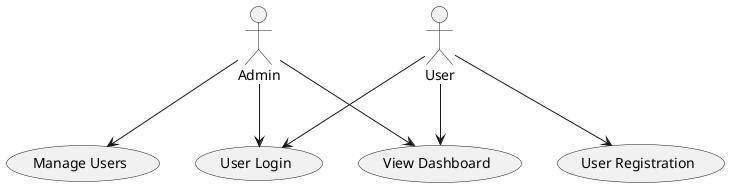
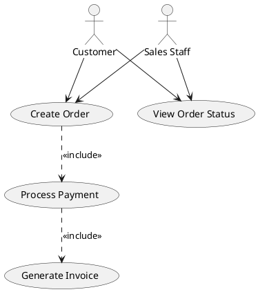
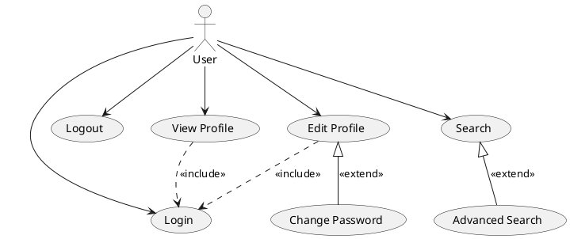

# Use Case Diagram | 用例图

**官方文档**: https://plantuml.com/zh/use-case-diagram

## Instructions

Use case diagrams show the interactions between actors and the system. They are useful for requirements analysis and system design.

## Key Concepts

- Use `@startuml` and `@enduml` to wrap the diagram
- Use `actor` to define actors
- Use `usecase` or `(Use Case)` to define use cases
- Use `package` to group use cases
- Use relationships: `-->`, `<|--`, `..>`, etc.
- Use `note` for annotations

## Example: Basic Use Case Diagram

## Example: With Relationships

## Example: With Extends and Includes

## Key Points

- Use `actor` to define actors
- Use `usecase` or `(Use Case)` to define use cases
- Use `-->` for associations
- Use `..>` for include relationships
- Use `<|--` for extend relationships
- Use `package` to group related use cases
- Use `note` for additional documentation
