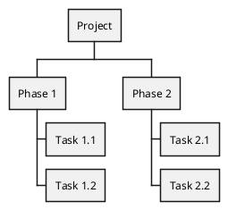
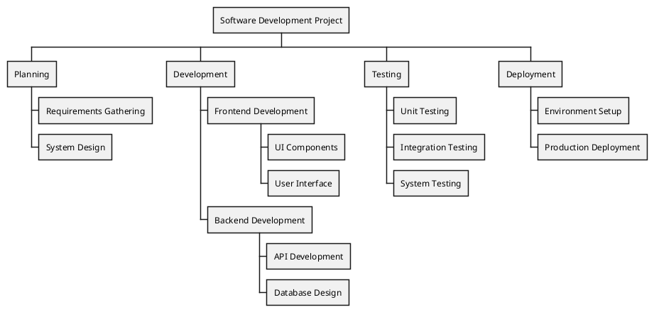
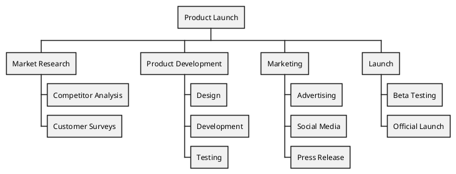

# WBS Diagram | 工作分解结构图

**官方文档**: https://plantuml.com/zh/wbs-diagram

## Instructions

WBS (Work Breakdown Structure) diagrams show hierarchical breakdown of work into smaller components. They are useful for project planning and management.

## Key Concepts

- Use `@startwbs` and `@endwbs` to wrap the diagram
- Use `*` for root level
- Use `**` for second level, `***` for third level, etc.
- Shows hierarchical work structure

## Example: Basic WBS Diagram

## Example: Software Development WBS

## Example: Product Launch WBS

## Key Points

- Use `@startwbs` and `@endwbs` for WBS diagrams
- Use `*` for root level
- Use `**`, `***`, etc. for nested levels
- WBS diagrams show work breakdown structure
- WBS diagrams are ideal for project planning
