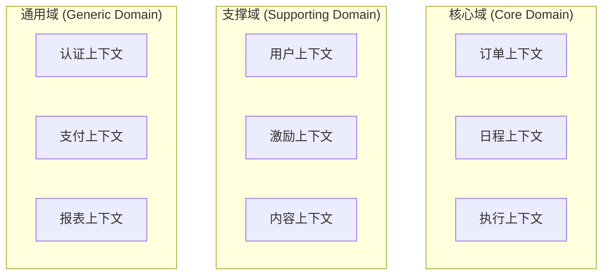
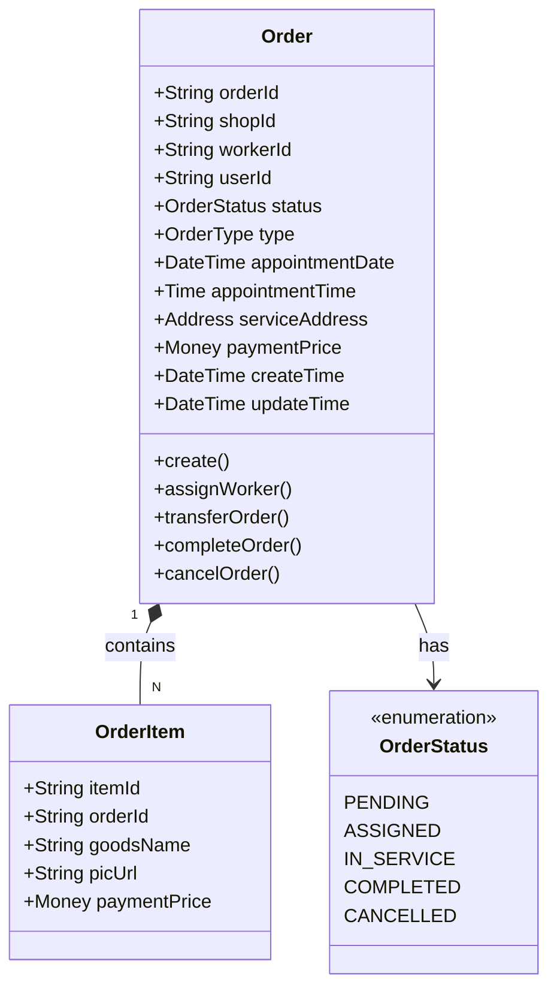
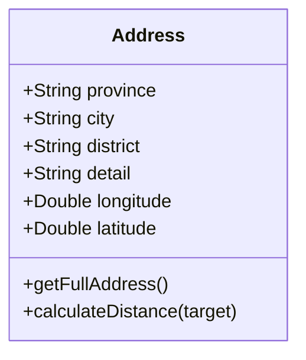
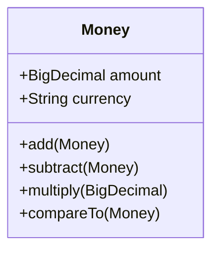
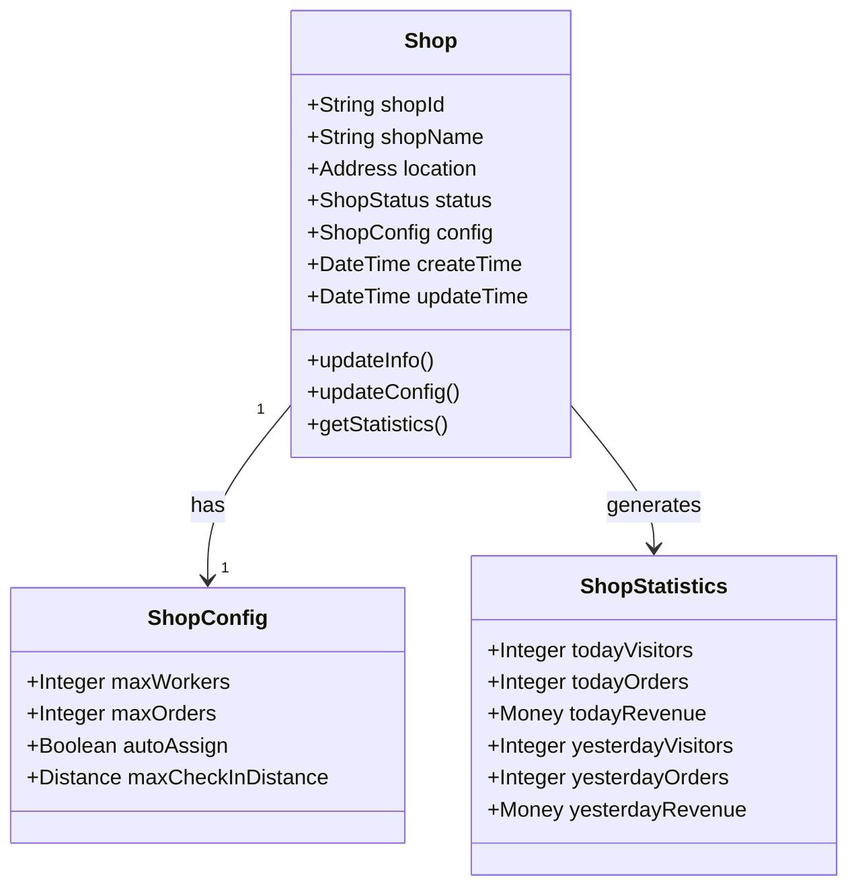
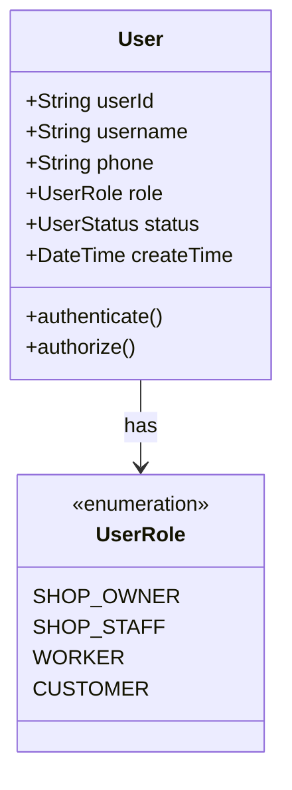
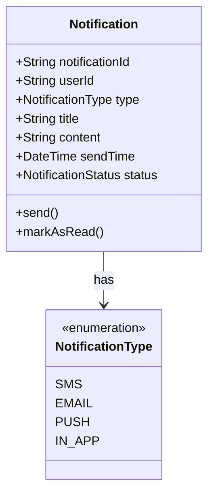
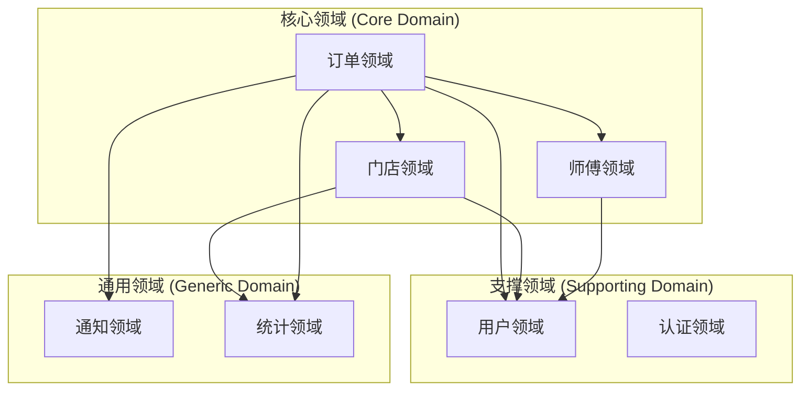
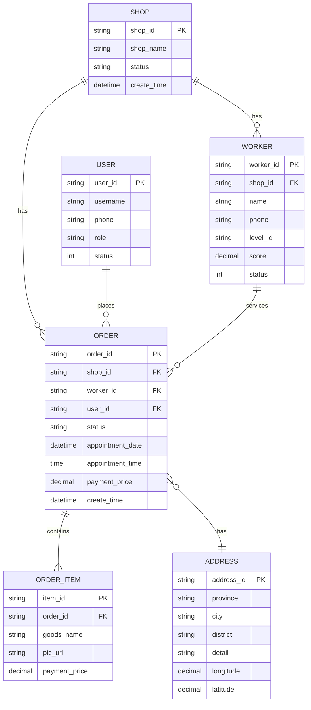

# {产品名称} - 领域模型说明文档 V1.0

> **文档说明**：
> - 本文档用于描述产品的领域模型设计，包括领域划分、实体关系、领域服务等
> - 基于领域驱动设计（DDD）思想，明确业务领域边界和核心概念
> - `{}` 包裹的内容为占位符，请替换为实际内容
> - 引用块 `>` 中的文字为填写指导，填写后可删除

---

## 1. 文档信息 (Document Info)

### 1.1 版本记录
| 版本号 | 修改日期 | 修改人 | 修改内容 | 备注 |
| :--- | :--- | :--- | :--- | :--- |
| V1.0.0 | {YYYY-MM-DD} | {姓名} | 初始版本 | - |

### 1.2 文档责任人
| 角色 | 姓名 | 职责 |
| :--- | :--- | :--- |
| 架构师 | {姓名} | 领域模型设计、架构评审 |
| 产品经理 | {姓名} | 业务需求确认、领域边界确认 |
| 开发负责人 | {姓名} | 领域模型实现、技术评审 |

---

## 2. 战略设计 (Strategic Design)

### 2.1 限界上下文 (Bounded Contexts)
> 基于业务复杂度与团队协作边界，将系统划分为核心上下文

**上下文划分原则**：
- **高内聚**：相关业务概念聚合在一起
- **低耦合**：不同领域之间通过接口交互
- **业务边界清晰**：每个领域有明确的业务边界
- **团队边界**：考虑团队组织结构和协作边界

**限界上下文列表**：



| 上下文名称 | 上下文类型 | 领域描述 | 核心职责 |
| :--- | :--- | :--- | :--- |
| {订单上下文} | 核心域 | {订单相关的业务逻辑} | {订单创建、订单处理、订单状态管理} |
| {门店上下文} | 核心域 | {门店相关的业务逻辑} | {门店信息管理、门店数据统计} |
| {用户上下文} | 支撑域 | {用户相关的业务逻辑} | {用户认证、用户信息管理、用户关系管理} |
| {激励上下文} | 支撑域 | {激励相关的业务逻辑} | {积分、勋章、愿望清单} |

### 2.2 统一语言 (Ubiquitous Language)
> 定义领域内的统一术语，确保团队沟通一致

| 中文术语 | 英文术语 | 定义/说明 |
| :--- | :--- | :--- |
| **订单** | `Order` | 客户下单产生的服务订单 |
| **工单** | `WorkOrder` | 需要师傅执行的服务工单 |
| **任务** | `Task` | 具体的待办事项，如"早读"、"跳绳" |
| **打卡** | `CheckIn` | 用户完成任务的动作记录 |
| **专注会话** | `FocusSession` | 一次完整的专注过程（如番茄钟） |
| **积分** | `Points` | 用于激励体系的虚拟货币（UI显示为"星星"） |
| **勋章** | `Badge` | 达成特定成就后获得的虚拟荣誉 |
| **愿望** | `Wish` | 使用积分兑换的奖励（如周末去公园） |

## 3. 领域概述 (Domain Overview)

### 3.1 业务领域
> 描述产品的业务领域

**核心业务领域**：
{例如：门店管理、订单管理、师傅管理、客户管理等}

**业务目标**：
- {例如：提升门店运营效率}
- {例如：优化订单处理流程}
- {例如：提升服务质量}

### 3.2 领域划分
> 明确领域划分

**领域列表**：

| 领域名称 | 领域描述 | 核心职责 |
| :--- | :--- | :--- |
| {订单领域} | {订单相关的业务逻辑} | {订单创建、订单处理、订单状态管理} |
| {门店领域} | {门店相关的业务逻辑} | {门店信息管理、门店数据统计} |
| {师傅领域} | {师傅相关的业务逻辑} | {师傅管理、师傅工作流程} |
| {客户领域} | {客户相关的业务逻辑} | {客户信息管理、客户关系管理} |

---

## 4. 战术设计 (Tactical Design)

## 5. 核心领域 (Core Domain)

### 3.1 {领域名称 - 例如：订单领域}

#### 5.1.1 领域描述
> 描述领域的业务职责和边界

**领域职责**：
- {例如：订单的创建、处理、状态管理}
- {例如：订单的分配、转派、完成}
- {例如：订单的数据统计和分析}

**领域边界**：
- **包含**：订单实体、订单状态、订单操作
- **不包含**：门店信息（属于门店领域）、客户信息（属于客户领域）

#### 5.1.2 聚合根 (Aggregate Root)
> 定义聚合根，作为聚合的入口

**订单聚合根 (Order Aggregate)**：
- **聚合根**：`Order`
- **职责**：管理订单的完整生命周期，确保订单数据的一致性
- **边界**：包含订单主信息、订单明细、订单状态等

#### 5.1.3 领域实体 (Domain Entities)

**订单实体 (Order)**：


**实体属性说明**：

| 属性 | 类型 | 说明 | 约束 |
| :--- | :--- | :--- | :--- |
| orderId | String | 订单ID | 主键，唯一标识 |
| shopId | String | 门店ID | 外键，关联门店 |
| workerId | String | 师傅ID | 外键，关联师傅 |
| userId | String | 客户ID | 外键，关联客户 |
| status | OrderStatus | 订单状态 | 枚举值 |
| type | OrderType | 订单类型 | 枚举值（上门订单/服务订单） |
| appointmentDate | DateTime | 预约日期 | 必填 |
| appointmentTime | Time | 预约时间 | 必填 |
| serviceAddress | Address | 服务地址 | 值对象 |
| paymentPrice | Money | 订单金额 | 值对象，保留2位小数 |

**实体方法说明**：
- **create()**：创建订单，初始化订单状态为PENDING
- **assignWorker(workerId)**：指派师傅，更新订单状态为ASSIGNED
- **transferOrder(newWorkerId)**：转派订单，更新师傅和状态
- **completeOrder()**：完成订单，更新订单状态为COMPLETED
- **cancelOrder()**：取消订单，更新订单状态为CANCELLED

#### 5.1.4 值对象 (Value Objects)

**地址值对象 (Address)**：


**值对象属性说明**：

| 属性 | 类型 | 说明 |
| :--- | :--- | :--- |
| province | String | 省份 |
| city | String | 城市 |
| district | String | 区县 |
| detail | String | 详细地址 |
| longitude | Double | 经度 |
| latitude | Double | 纬度 |

**金额值对象 (Money)**：


#### 5.1.5 领域服务 (Domain Services)

**订单分配服务 (OrderAssignmentService)**：
- **职责**：处理订单分配逻辑
- **方法**：
  - `assignOrder(orderId, workerId)`: 指派订单给师傅
  - `transferOrder(orderId, newWorkerId)`: 转派订单
  - `calculateDistance(orderId, workerLocation)`: 计算订单距离

**订单状态服务 (OrderStatusService)**：
- **职责**：管理订单状态流转
- **方法**：
  - `updateStatus(orderId, newStatus)`: 更新订单状态
  - `validateStatusTransition(currentStatus, newStatus)`: 验证状态流转是否合法
  - `getAvailableStatuses(currentStatus)`: 获取可用的状态列表

#### 5.1.6 领域事件 (Domain Events)

**订单已创建事件 (OrderCreatedEvent)**：
- **触发时机**：订单创建成功
- **事件数据**：订单ID、门店ID、客户ID、订单类型
- **订阅者**：订单通知服务、数据统计服务

**订单已分配事件 (OrderAssignedEvent)**：
- **触发时机**：订单分配成功
- **事件数据**：订单ID、师傅ID、分配时间
- **订阅者**：通知服务（通知师傅）

**订单已完成事件 (OrderCompletedEvent)**：
- **触发时机**：订单完成
- **事件数据**：订单ID、完成时间、服务时长
- **订阅者**：数据统计服务、结算服务

---

### 5.2 {领域名称 - 例如：门店领域}

#### 5.2.1 领域描述
> 描述领域的业务职责和边界

**领域职责**：
- {例如：门店信息管理}
- {例如：门店数据统计}
- {例如：门店配置管理}

**领域边界**：
- **包含**：门店实体、门店数据统计、门店配置
- **不包含**：订单信息（属于订单领域）、师傅信息（属于师傅领域）

#### 5.2.2 领域实体 (Domain Entities)

**门店实体 (Shop)**：


**实体属性说明**：

| 属性 | 类型 | 说明 |
| :--- | :--- | :--- |
| shopId | String | 门店ID |
| shopName | String | 门店名称 |
| location | Address | 门店位置 |
| status | ShopStatus | 门店状态 |
| config | ShopConfig | 门店配置 |

#### 5.2.3 领域服务 (Domain Services)

**门店统计服务 (ShopStatisticsService)**：
- **职责**：计算门店统计数据
- **方法**：
  - `calculateTodayStatistics(shopId)`: 计算今日统计数据
  - `calculateYesterdayStatistics(shopId)`: 计算昨日统计数据
  - `compareStatistics(today, yesterday)`: 对比统计数据

---

## 6. 支撑领域 (Supporting Domain)

### 6.1 {领域名称 - 例如：用户领域}

#### 6.1.1 领域描述
> 描述支撑领域的职责

**领域职责**：
- {例如：用户认证、用户授权}
- {例如：用户信息管理}
- {例如：角色权限管理}

**领域边界**：
- **包含**：用户实体、角色实体、权限实体
- **不包含**：业务逻辑（属于核心领域）

#### 6.1.2 领域实体 (Domain Entities)

**用户实体 (User)**：


---

## 7. 通用领域 (Generic Domain)

### 7.1 {领域名称 - 例如：通知领域}

#### 5.1.1 领域描述
> 描述通用领域的职责

**领域职责**：
- {例如：消息通知、推送通知}
- {例如：短信通知、邮件通知}

**领域边界**：
- **包含**：通知实体、通知服务
- **不包含**：业务逻辑（属于核心领域）

#### 7.1.2 领域实体 (Domain Entities)

**通知实体 (Notification)**：


---

## 8. 领域关系图 (Domain Relationships)

### 8.1 领域关系总览
> 使用Mermaid图展示领域之间的关系



### 8.2 实体关系图 (Entity Relationship Diagram)
> 使用ER图展示实体之间的关系



---

## 9. 领域服务接口 (Domain Service Interfaces)

### 9.1 订单领域服务接口

**订单分配服务接口 (IOrderAssignmentService)**：
```typescript
interface IOrderAssignmentService {
  /**
   * 指派订单给师傅
   * @param orderId 订单ID
   * @param workerId 师傅ID
   * @returns 分配结果
   */
  assignOrder(orderId: string, workerId: string): Promise<AssignmentResult>;
  
  /**
   * 转派订单
   * @param orderId 订单ID
   * @param newWorkerId 新师傅ID
   * @returns 转派结果
   */
  transferOrder(orderId: string, newWorkerId: string): Promise<TransferResult>;
  
  /**
   * 计算订单距离
   * @param orderId 订单ID
   * @param workerLocation 师傅位置
   * @returns 距离（公里）
   */
  calculateDistance(orderId: string, workerLocation: Location): Promise<number>;
}
```

### 9.2 门店领域服务接口

**门店统计服务接口 (IShopStatisticsService)**：
```typescript
interface IShopStatisticsService {
  /**
   * 获取门店统计数据
   * @param shopId 门店ID
   * @param date 日期
   * @returns 统计数据
   */
  getStatistics(shopId: string, date: Date): Promise<ShopStatistics>;
  
  /**
   * 对比统计数据
   * @param today 今日统计
   * @param yesterday 昨日统计
   * @returns 对比结果
   */
  compareStatistics(today: ShopStatistics, yesterday: ShopStatistics): ComparisonResult;
}
```

---

## 10. 领域事件定义 (Domain Events Definition)

### 10.1 事件列表
> 列出所有领域事件

| 事件名称 | 事件类型 | 触发时机 | 事件数据 | 订阅者 |
| :--- | :--- | :--- | :--- | :--- |
| OrderCreatedEvent | 订单已创建 | 订单创建成功 | orderId, shopId, userId, type | 通知服务、统计服务 |
| OrderAssignedEvent | 订单已分配 | 订单分配成功 | orderId, workerId, assignTime | 通知服务 |
| OrderCompletedEvent | 订单已完成 | 订单完成 | orderId, completeTime, duration | 统计服务、结算服务 |
| OrderCancelledEvent | 订单已取消 | 订单取消 | orderId, cancelTime, reason | 通知服务、统计服务 |

### 10.2 事件定义
> 定义事件的数据结构

**订单已创建事件 (OrderCreatedEvent)**：
```typescript
interface OrderCreatedEvent {
  eventId: string;
  eventType: 'OrderCreated';
  timestamp: Date;
  data: {
    orderId: string;
    shopId: string;
    userId: string;
    orderType: OrderType;
    appointmentDate: Date;
    appointmentTime: Time;
    paymentPrice: Money;
  };
}
```

---

## 11. 领域模型规则 (Domain Model Rules)

### 11.1 业务规则
> 定义领域模型的业务规则

**订单领域规则**：
1. **订单创建规则**：
   - 订单必须关联门店
   - 订单必须关联客户
   - 订单金额必须大于0
   - 预约时间必须晚于当前时间

2. **订单分配规则**：
   - 只有待接单状态的订单才能分配
   - 师傅必须属于订单所在门店
   - 师傅状态必须为可用

3. **订单状态流转规则**：
   - 待接单 → 待服务 → 服务中 → 已完成
   - 待接单 → 已取消
   - 待服务 → 已取消
   - 不允许跨状态流转

**门店领域规则**：
1. **门店创建规则**：
   - 门店名称不能为空
   - 门店位置必须有效
   - 门店状态必须为有效状态

2. **门店统计规则**：
   - 统计数据按门店隔离
   - 统计数据按日期统计
   - 统计数据实时更新

### 11.2 数据一致性规则
> 定义数据一致性规则

**订单数据一致性**：
- 订单状态变更必须记录操作日志
- 订单金额变更必须记录变更历史
- 订单分配必须更新师傅工作状态

**门店数据一致性**：
- 门店信息变更必须记录变更历史
- 门店统计数据必须与订单数据一致
- 门店配置变更必须生效

---

## 12. 领域模型实现 (Domain Model Implementation)

### 12.1 实体实现
> 说明实体的实现方式

**订单实体实现**：
```java
@Entity
@Table(name = "work_order_info")
public class Order {
    @Id
    private String orderId;
    
    @Column(name = "shop_id")
    private String shopId;
    
    @Column(name = "worker_id")
    private String workerId;
    
    @Enumerated(EnumType.STRING)
    @Column(name = "status")
    private OrderStatus status;
    
    @Embedded
    private Address serviceAddress;
    
    @Embedded
    private Money paymentPrice;
    
    public void assignWorker(String workerId) {
        if (this.status != OrderStatus.PENDING) {
            throw new IllegalStateException("只能分配待接单状态的订单");
        }
        this.workerId = workerId;
        this.status = OrderStatus.ASSIGNED;
        // 发布领域事件
        DomainEventPublisher.publish(new OrderAssignedEvent(this.orderId, workerId));
    }
    
    public void completeOrder() {
        if (this.status != OrderStatus.IN_SERVICE) {
            throw new IllegalStateException("只能完成服务中状态的订单");
        }
        this.status = OrderStatus.COMPLETED;
        // 发布领域事件
        DomainEventPublisher.publish(new OrderCompletedEvent(this.orderId));
    }
}
```

### 12.2 领域服务实现
> 说明领域服务的实现方式

**订单分配服务实现**：
```java
@Service
public class OrderAssignmentService implements IOrderAssignmentService {
    
    @Autowired
    private OrderRepository orderRepository;
    
    @Autowired
    private WorkerRepository workerRepository;
    
    @Override
    public AssignmentResult assignOrder(String orderId, String workerId) {
        Order order = orderRepository.findById(orderId)
            .orElseThrow(() -> new OrderNotFoundException(orderId));
        
        Worker worker = workerRepository.findById(workerId)
            .orElseThrow(() -> new WorkerNotFoundException(workerId));
        
        // 业务规则验证
        if (!order.getShopId().equals(worker.getShopId())) {
            throw new BusinessException("师傅必须属于订单所在门店");
        }
        
        if (worker.getStatus() != WorkerStatus.AVAILABLE) {
            throw new BusinessException("师傅状态必须为可用");
        }
        
        // 执行分配
        order.assignWorker(workerId);
        orderRepository.save(order);
        
        return new AssignmentResult(true, "分配成功");
    }
}
```

---

## 13. 领域模型映射 (Domain Model Mapping)

### 13.1 实体到数据库映射
> 说明实体到数据库表的映射关系

| 实体 | 数据库表 | 映射说明 |
| :--- | :--- | :--- |
| Order | work_order_info | 订单主表 |
| OrderItem | work_order_item | 订单明细表 |
| Shop | shop_info | 门店信息表 |
| Worker | worker_user | 师傅表 |
| User | user_info | 用户表 |

### 13.2 值对象映射
> 说明值对象到数据库字段的映射

| 值对象 | 数据库字段 | 映射说明 |
| :--- | :--- | :--- |
| Address | service_address, service_address_lng, service_address_lat | 地址值对象映射到多个字段 |
| Money | payment_price | 金额值对象映射到decimal字段 |

---

## 14. 领域模型演进 (Domain Model Evolution)

### 14.1 版本历史
> 记录领域模型的版本历史

| 版本 | 日期 | 变更内容 | 变更原因 |
| :--- | :--- | :--- | :--- |
| V1.0.0 | {YYYY-MM-DD} | 初始版本 | 初始设计 |
| V1.1.0 | {YYYY-MM-DD} | 新增订单转派功能 | 业务需求 |
| V1.2.0 | {YYYY-MM-DD} | 优化订单状态流转 | 业务优化 |

### 14.2 未来规划
> 说明领域模型的未来规划

**规划内容**：
- {例如：增加订单评价领域}
- {例如：增加客户关系管理领域}
- {例如：优化订单分配算法}

---

## 15. 附录 (Appendix)

### 15.1 术语表
> 定义文档中使用的专业术语

| 术语 | 定义 |
| :--- | :--- |
| 领域 (Domain) | 业务领域，一组相关的业务概念和规则 |
| 实体 (Entity) | 有唯一标识的业务对象 |
| 值对象 (Value Object) | 没有唯一标识，通过值相等判断的对象 |
| 领域服务 (Domain Service) | 不属于特定实体的业务逻辑 |
| 领域事件 (Domain Event) | 领域内发生的重要业务事件 |
| 聚合 (Aggregate) | 一组相关对象的集合，有明确的边界 |
| 仓储 (Repository) | 封装数据访问逻辑的接口 |

### 15.2 参考文档
> 列出参考的相关文档

- [需求分析模板](4、需求分析模板.md)
- [PRD文档模板](5、PRD文档模板.md)
- [系统架构设计模板](9、系统架构设计模板.md)
- [技术细分模板](10、技术细分模板.md)

### 15.3 变更记录
> 记录领域模型变更的历史

| 变更日期 | 变更内容 | 变更原因 | 变更人 |
| :--- | :--- | :--- | :--- |
| {YYYY-MM-DD} | {变更内容描述} | {变更原因} | {姓名} |

---

**文档版本**：V1.0.0  
**创建时间**：{YYYY-MM-DD}  
**最后更新**：{YYYY-MM-DD}  
**文档状态**：✅ 设计中 / ✅ 待评审 / ✅ 评审通过 / ✅ 已完成
